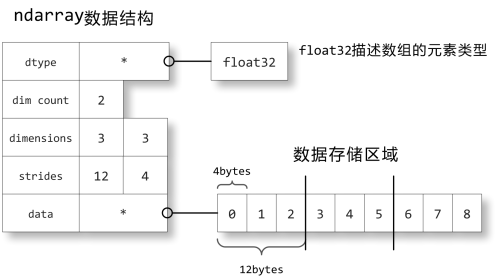
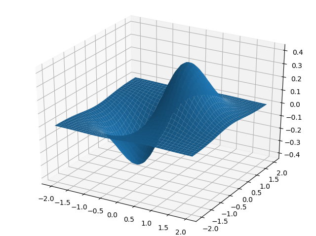

# Python for Science Introduction

- [Python for Science Introduction](#python-for-science-introduction)
  - [some libs](#some-libs)
  - [ndarray object](#ndarray-object)
    - [create array](#create-array)
    - [numpy index](#numpy-index)
      - [使用`:`标准方法读写数据](#%e4%bd%bf%e7%94%a8%e6%a0%87%e5%87%86%e6%96%b9%e6%b3%95%e8%af%bb%e5%86%99%e6%95%b0%e6%8d%ae)
      - [使用序列来读写](#%e4%bd%bf%e7%94%a8%e5%ba%8f%e5%88%97%e6%9d%a5%e8%af%bb%e5%86%99)
      - [bool数组&bool列表](#bool%e6%95%b0%e7%bb%84bool%e5%88%97%e8%a1%a8)
    - [multi-dimensional arange](#multi-dimensional-arange)
    - [structure array](#structure-array)
    - [ndarray in memory](#ndarray-in-memory)
  - [ufunc(universal function)](#ufuncuniversal-function)
    - [some basic operator](#some-basic-operator)
    - [broadcasting](#broadcasting)
    - [other ufuncs](#other-ufuncs)
  - [Matrix Operation](#matrix-operation)
    - [matrix vs array](#matrix-vs-array)
    - [`np.dot()`](#npdot)
    - [`np.outer()`](#npouter)
    - [`np.inner()`](#npinner)
    - [`np.linalg`](#nplinalg)
  - [file operation](#file-operation)

## some libs


- NumPy: 多维数组处理
- SciPy: 提供处理NumPy数组的函数
- SymPy: 符号计算
- Traits: GUI
- matplotlib: 2d plot, 3d plot
- OpenCV: 可用于开发实时的图像处理、计算机视觉以及模式识别程序

## ndarray object

### create array

```python
# 低效率的做法，先弄一个python sequence, 然后用array来转换
import numpy as np

a0 = np.array([1, 2, 3, 4])
a1 = np.array(range(1, 5, 1))
print(a0)
print(a1)
# 获取数组元素类型
print(a0.dtype, a1.dtype)  # int32 int32
print(a0.shape, a1.shape) # (4,) (4,)

#
b0 = np.array([[1, 2, 3, 4], [5, 6, 7, 8], [9, 10, 11, 12]])
b1 = np.array([range(1, 5), range(4, 8), range(7, 11)])
print(b0)
print(b1)
print(b0.dtype, b1.dtype)  # int32 int32
print(b0.shape, b1.shape) # (3,4) (3,4)

# 不是转置，内存中的顺序不变
b0.shape=4,3
print(b0)
print(b0.shape)
# -1在列上面，表示自动计算
b1.shape=2,-1
print(b1)

# c1,c2和a0共享数据，修改a0也会改变c1,c2
c1=a0.reshape(2,2)
c2=a0.reshape((4,1))
print(c1)
print(c2)

# 指定类型创建array
d1=np.array(range(6), dtype=np.float)
print(d1) # [ 0.  1.  2.  3.  4.  5.]
d2=np.array(range(6), dtype=np.complex)
print(d2) # [ 0.+0.j  1.+0.j  2.+0.j  3.+0.j  4.+0.j  5.+0.j]
```

```python
# 提高效率，直接用np.arange()创建数组
import numpy as np

a1 = np.arange(10)
a2 = np.arange(0, 1, 0.1)
print(a1)  # [0 1 2 3 4 5 6 7 8 9]
print(a2)  # [ 0.   0.1  0.2  0.3  0.4  0.5  0.6  0.7  0.8  0.9]

b1 = np.linspace(0, 1, 10)
print(b1) # [ 0.  0.11111111  0.22222222  0.33333333  0.44444444  0.55555556  0.66666667  0.77777778  0.88888889  1.]

c1 = np.logspace(0, 5, 4)
print(c1) # [  1.00000000e+00   4.64158883e+01   2.15443469e+03   1.00000000e+05]

str1='abcdefgh'
d1=np.fromstring(str1, dtype=np.int8)
print(d1) # [ 97  98  99 100 101 102 103 104]
d2=np.fromstring(str1, dtype=np.int16)
# 98*256+97=25185
print(d2) # [25185 25699 26213 26727]
d3=np.fromstring(str1, dtype=np.float)
print(d3) # [  8.54088322e+194]

# 用途: 用C语言的二进制方式写了一组double类型的数值到某个文件中，那们可以从此文件读取相应的数据，并通过fromstring函数将其转换为float64类型的数组
```

```python
# fromfunc
import numpy as np

def func1(i):
    return i%4+1

def func2(i):
    return i
# 将数组的下标经过运算变成数组元素, 第二个为元素个数
a1=np.fromfunction(func1, (10,))
a2=np.fromfunction(func2, (10,))

print(a1) # [ 1.  2.  3.  4.  1.  2.  3.  4.  1.  2.]
print(a2) # [ 0.  1.  2.  3.  4.  5.  6.  7.  8.  9.]

# 9x9乘法结果表
def func3(i,j):
    return (i+1)*(j+1)

c1=np.fromfunction(func3, (9, 9))
print(c1)
```

### numpy index

#### 使用`:`标准方法读写数据

数组元素的存取方法和Python的标准方法相同

和Python的列表序列不同，通过下标范围获取的新的数组是原始数组的一个视图。它与原始数组**共享**同一块数据空间：

```python
import numpy as np

a0 = np.arange(10)
a1 = a0[3:-1]
print(a1)  # [3 4 5 6 7 8]
a1[0] = 333
print(a0)  # [  0   1   2 333   4   5   6   7   8   9]
# 逆序
print(a0[::-1])
```

#### 使用序列来读写

它与原始数组**不共享**同一块数据空间

```python
import numpy as np

a0 = np.arange(10, 0, -1)
print(a0) # [10  9  8  7  6  5  4  3  2 1]
a1=a0[[1, 2, 3]] # [9 8 7]
print(a1)
a1[0]=999
print(a0)

a2=a0[np.array([0, -1, 2])]
print(a2) # [10  1  8]
a2[0]=10000
print(a0)

# 使用整数数列来修改原始的数据
a0[[0, 1, 2]]=1000,999,888
print(a0) # [1000  999  888    7    6    5    4    3    2    1]
```

#### bool数组&bool列表

它与原始数组**不共享**同一块数据空间

```python
import numpy as np

x = np.arange(5,0,-1)
print(x) # [5 4 3 2 1]
# bool数组& bool列表， 要求长度一致
ba1 = x[np.array([True, False, True, False, True])]
print(ba1) # [5 3 1]
ba2=x[[True, False, True, False, True]]
print(ba2) # [5 3 1]

x[[True, False, True, False, True]]=55, 33, 11
print(x) # [55  4 33  2 11]
```

布尔数组一般不是手工产生，而是使用布尔运算的`ufunc`函数产生

```python
import numpy as np

x = np.random.rand(10)
print(x)
print(x>0.5)
a1=x[x>0.5]
print(a1)
```

```bash
# output
[ 0.54370591  0.39412956  0.19669597  0.01887507  0.28639486  0.6285483
  0.29764686  0.97601961  0.33480994  0.83810404]

[ True False False False False  True False  True False  True]

[ 0.54370591  0.6285483   0.97601961  0.83810404]
```

### multi-dimensional arange

```python
import numpy as np

x=np.arange(0, 60, 10).reshape(-1, 1)+np.arange(0,6)
# [[ 0  1  2  3  4  5]
#  [10 11 12 13 14 15]
#  [20 21 22 23 24 25]
#  [30 31 32 33 34 35]
#  [40 41 42 43 44 45]
#  [50 51 52 53 54 55]]

# multi-dimension index
print(x[0,3:5]) # [3 4]

print(x[1,:]) # [10 11 12 13 14 15]

print(x[4:, 4:])
# [[44 45]
#  [54 55]]

# start=0, stop<3, step=2
print(x[2::2,:3:2])
# [[20 22]
#  [40 42]]

# 数列索引
print(x[(0,1,2),(0,1,2)]) # [ 0 11 22]

print(x[3:,[0,1,2]])
# [[30 31 32]
#  [40 41 42]
#  [50 51 52]]

mask=np.array([1,0,1,0,0,1], dtype=np.bool)
print(x[3, mask]) # [30 32 35]
print(x[mask, 3]) # [ 3 23 53]
```

### structure array

只要NumPy中的结构定义和C语言中的定义相同，NumPy就可以很方便地读取C语言的结构数组的二进制数据，转换为NumPy的结构数组

- `|` : 忽视字节顺序
- `<` : 低位字节在前
- `>` : 高位字节在前

```python
import numpy as np

person_type=np.dtype({
    'names':['name', 'age', 'weight'],
    # 32bit string, int32, float32
    'formats':['S32', 'i', 'f']
})

p1=np.array([('grey', 26, 50.2),('chris', 23, 56.5), ('moris', 24, 62.0)], dtype=person_type)
print(p1.dtype) # [('name', 'S32'), ('age', '<i4'), ('weight', '<f4')]
print(p1) # [(b'grey', 26,  50.20000076) (b'chris', 23,  56.5) (b'moris', 24,  62.)]
print(p1[1], p1[1].dtype) # (b'chris', 23,  56.5) [('name', 'S32'), ('age', '<i4'), ('weight', '<f4')]

# 数据是共享的
pp1=p1[0]
pp1['name']='AlphaGrey'
print(p1[0]['name']) # b'AlphaGrey'

b1=p1[:]['age']
# # or
# b1=p1['age']
print(b1) # [26 23 24]
# 数据是共享的
b1[0]=100
print(p1['age']) # [100  23  24]

# 输出到二进制字符串
str1=p1.tostring()
print(str1) # 直接变成二进制字符串
# 输出到二进制文件
p1.tofile('myTest.bin')
```

利用C语言获取上面的`myTest.bin`里面的数据

```c
#include <stdio.h>

struct person
{
    char name[32];
    int age;
    float weight;
};

struct person p[2];

void main ()
{
    FILE *fp;
    fp=fopen("myTest.bin","rb");
    fread(p, sizeof(struct person), 2, fp);
    fclose(fp);
    for (int i = 0; i < 2; ++i) {
        printf("%s %d %f\n", p[i].name, p[i].age, p[i].weight);
    }
    // AlphaGrey 100 50.200001
    // chris 23 56.500000
}
```

```python
import numpy as np

# another method
type1=np.dtype([
    ('age', np.int32),
    ('weight', np.float)
])

# nested
type2=np.dtype([
    ('info', type1),
    ('scores', np.float_)
])

p1=np.array([
    ((26, 55.5),98.5),
    ((22, 60.5),96.5),
], dtype=type2)

print(p1) # [((26,  55.5),  98.5) ((22,  60.5),  96.5)]
print(p1.dtype) # [('info', [('age', '<i4'), ('weight', '<f8')]), ('scores', '<f8')]

type3=np.dtype([
    ('prop1', 'i4'),
    # 第三个参数表示数组是2x3的
    ('prop2', 'f8', (2, 3)),
])

print(type3) # [('prop1', '<i4'), ('prop2', '<f8', (2, 3))]

# 少见的方法，用dictionary， 需要给出偏移量
type4=np.dtype({
    'name':('S25', 0),
    'age': (np.int32, 25),
    'weight': (np.float, 57),
})

print(type4) # {'names':['name','age','weight'], 'formats':['S25','<i4','<f8'], 'offsets':[0,25,57], 'itemsize':65}
```

### ndarray in memory



```python
import numpy as np

x = np.array([[0,1,2],[3,4,5],[6,7,8]], dtype=np.float32)
print(x.strides) # (12, 4)
# 因为共享数据，数据不一定连续存储比如 b就是x的一个视图
b=x[::2,::2]
print(b.strides) # (24, 8)
```

在C语言中，多维数组的第0轴是最上位的，即第0轴的下标增加1时，元素的地址增加的字节数最多；而Fortan语言的多维数组的第0轴是最下位的，即第0轴的下标增加1时，地址只增加一个元素的字节数

```python
import numpy as np

x = np.array([[0,1,2],[3,4,5],[6,7,8]], dtype=np.float32, order='F')
print(x)
print(x.strides) # (4, 12)
```

## ufunc(universal function)

NumPy内置的许多ufunc函数都是在C语言级别实现的，因此它们的计算速度非常快

```python
import numpy as np

x=np.linspace(0, 2*np.pi, 10)
y1=np.sin(x)
print(y1)

# 将运算的结果直接赋值给x
y2=np.cos(x,x)
print(x)
print(id(y2)==id(x)) # True
```

`np.sin()` vs `math.sin()`

```python
import time
import math
import numpy as np

# for python lib
time_start=time.clock()
x1=[0.001*i for i in range(1000000)]
for i in range(1000000):
    x1[i]=math.sin(x1[i])
print('math.sin:',time.clock()-time_start)

# for numpy lib
time_start=time.clock()
x2=np.arange(0, 1000, 0.001)
np.sin(x2, x2)
print('numpy.sin:', time.clock()-time_start)

# numpy lib but one by one
time_start=time.clock()
x3=[0.001*i for i in range(1000000)]
for i in range(1000000):
    x3[i]=np.sin(x3[i])
print('one-by-one, numpy.sin:', time.clock()-time_start)
```

```bash
# output
math.sin: 0.4436744694780136
numpy.sin: 0.009411106928396917
one-by-one, numpy.sin: 1.1711034795095645
```

- 如果是一个一个计算，`math.sin`的速度是`numpy.sin`5倍：因为numpy.sin为了同时支持数组和单个值的计算，其C语言的内部实现要比math.sin复杂很多；math.sin返回的是Python的标准float类型，而numpy.sin则返回一个numpy.float64类型
- 如果`numpy.sin`直接使用C循环，速度是`math.sin`的10倍

### some basic operator

```python
import numpy as np

a1=np.arange(0,5)
a2=np.arange(1, 6)
print(a1, a2) # [0 1 2 3 4] [1 2 3 4 5]

print(np.add(a1, a2))
print(np.subtract(a2, a1))
print(np.multiply(a1, a2))
print(np.divide(a1, a2))
# print(np.true_divide(a1, a2)) # 现在也包含到了divide中
print(np.floor_divide(a1, a2)) # [0 0 0 0 0]， 总是取整数

print(np.negative(a1)) # [ 0 -1 -2 -3 -4]
print(np.power(a1, a2)) # [   0    1    8   81 1024]
print(np.power(a1, 3)) # [ 0  1  8 27 64]

print(np.remainder(a1, a2)) # [0 1 2 3 4]
```

写起来费劲，采用`frompyfunc`将python函数变成`ufunc`

```python
import numpy as np


def trifunc(x, c, c0, hc):
    # 三角波的周期为1，因此只取x坐标的小数部分进行计算
    x = x-int(x)
    if x>=c:
        r=0.0
    elif x<c0:
        r=x/c0*hc
    else:
        r=(c-x)/(c-c0)*hc
    return r

# 只能用trifunc计算单个的值，不能对数组操作，效率低下
x=np.linspace(0, 2, 100)
y1=np.array([trifunc(i, 0.6, 0.4, 1.0) for i in x])
print(y1)

# lambda 包装, 1个输入参数， 1个输出参数
tri_ufunc=np.frompyfunc(lambda i: trifunc(i, 0.6, 0.4, 1), 1, 1)
print(tri_ufunc(x))
```

```python
# 装饰器就是一种的闭包的应用，只不过其传递的是函数
# 并且采用装饰器语法糖
import numpy as np

def tri_ufunc(c, c0, hc):
    def trifunc(x):
        # 三角波的周期为1，因此只取x坐标的小数部分进行计算
        x = x-int(x)
        if x>=c:
            r=0.0
        elif x<c0:
            r=x/c0*hc
        else:
            r=(c-x)/(c-c0)*hc
        return r
    return np.frompyfunc(trifunc, 1, 1)

x=np.linspace(0, 2, 100)
y2=tri_ufunc(0.6, 0.4, 1)(x)
print(y2)
# 需要转换类型，如下
```

```python
# 装饰器法
import numpy as np

def tri_ufunc(pyfunc):
    def wrapper(*args):
        return pyfunc(*args)
    return np.frompyfunc(wrapper, 1, 1)

@tri_ufunc
def trifunc(x, c=0.4, c0=0.6, hc=1):
    x = x-int(x)
    if x>=c:
        r=0.0
    elif x<c0:
        r=x/c0*hc
    else:
        r=(c-x)/(c-c0)*hc
    return r

x=np.linspace(0, 2, 100)
y3=trifunc(x)
print(y3)
print(y3.dtype) # object
# 需要转换
y4=y3.astype(np.float64)
print(y4)
print(y3.dtype,y4.dtype) # object float64
```

### broadcasting

n维矩阵就有n个`[`

```python
import numpy as np

b = np.arange(0, 8)
# 1d
print(b)
print('shape=',b.shape)

# 2d
b.shape=-1,4
print(b)
print('shape=',b.shape)

# interesting
b.shape=1,-1
print(b)
print('shape=',b.shape)

# 3d
b.shape=2,2,2
print(b)
print('shape=',b.shape)
```

```bash
# output
[0 1 2 3 4 5 6 7]
shape= (8,)

[[0 1 2 3]
 [4 5 6 7]]
shape= (2, 4)

[[0 1 2 3 4 5 6 7]]
shape= (1, 8)

[[[0 1]
  [2 3]]

 [[4 5]
  [6 7]]]
shape= (2, 2, 2)
```

ufunc函数会对这两个数组的对应元素进行计算，因此它要求这两个数组有相同的大小(shape相同)。如果两个数组的shape不同的话，会进行如下的广播(broadcasting)处理

- 让所有输入数组都向其中shape最长的数组看齐，shape中不足的部分都通过在前面加1补齐
- 输出数组的shape是输入数组shape的各个轴上的最大值
- 如果输入数组的某个轴和输出数组的对应轴的长度相同或者其长度为1时，这个数组能够用来计算，否则出错
- 当输入数组的某个轴的长度为1时，沿着此轴运算时都用此轴上的第一组值

```python
import numpy as np

a=np.arange(0, 60, 10).reshape(-1,1)
b=np.arange(5)
c=a+b
print(c)
# [[ 0  1  2  3  4]
#  [10 11 12 13 14]
#  [20 21 22 23 24]
#  [30 31 32 33 34]
#  [40 41 42 43 44]
#  [50 51 52 53 54]]

# 发生的过程
a=a.repeat(5, axis=1)
print(a)
# [[ 0  0  0  0  0]
#  [10 10 10 10 10]
#  [20 20 20 20 20]
#  [30 30 30 30 30]
#  [40 40 40 40 40]
#  [50 50 50 50 50]]
b.shape=1,5
b=b.repeat(6, axis=0)
print(b)
# [[0 1 2 3 4]
#  [0 1 2 3 4]
#  [0 1 2 3 4]
#  [0 1 2 3 4]
#  [0 1 2 3 4]
#  [0 1 2 3 4]]
print(a+b)
```

```python
import numpy as np

# 两种写法
# start:stop:step
# start:stop:(length)j
# ogrid是对象不是函数
a,b=np.ogrid[0:60:10, 0:4:5j]
print(a)
print(b)
print(a+b)
```

```bash
# output
[[  0.]
 [ 10.]
 [ 20.]
 [ 30.]
 [ 40.]
 [ 50.]]
[[ 0.  1.  2.  3.  4.]]
[[  0.   1.   2.   3.   4.]
 [ 10.  11.  12.  13.  14.]
 [ 20.  21.  22.  23.  24.]
 [ 30.  31.  32.  33.  34.]
 [ 40.  41.  42.  43.  44.]
 [ 50.  51.  52.  53.  54.]]
```

利用ogrid的返回值，我能很容易计算x, y网格面上各点的值，或者x, y, z网格体上各点的值

```python
import numpy as np
import matplotlib.pyplot as plt
from mpl_toolkits.mplot3d import Axes3D

x, y = np.ogrid[-2:2:40j, -2:2:40j]
z = x * np.exp(- x**2 - y**2)
print(z.shape) # (40, 40)

fig=plt.figure()
surf=Axes3D(fig).plot_surface(x, y, z)
plt.show()
```



### other ufuncs

`reduce`

```python
import numpy as np

# 1d
print(np.add.reduce([1,2,3])) # 6
a1=np.arange(5)
print(np.add.reduce(a1)) # 10

# 2d, 沿着不同的axis进行reduce
a2=np.arange(6)
a2.shape=2,3
print(a2)
# [[0 1 2]
#  [3 4 5]]
print(np.add.reduce(a2, axis=0)) # [3 5 7]
print(np.add.reduce(a2, axis=1)) # [3 12]
```

`accumulate`: 显示每一步`reduce`的结果

```python
import numpy as np

# 1d
a1=np.arange(5)
print(np.add.accumulate(a1)) # [ 0  1  3  6 10]

# 2d, 沿着不同的axis进行reduce
a2=np.arange(6)
a2.shape=2,3
print(a2)
# [[0 1 2]
#  [3 4 5]]
print(np.add.accumulate(a2, axis=0))
# [[0 1 2]
#  [3 5 7]]
print(np.add.accumulate(a2, axis=1))
# [[ 0  1  3]
#  [ 3  7 12]]
```

`reduceat`

pass

`outer`

```python
import numpy as np

a1=np.arange(4)
a1.shape=1,-1
print(a1)

b1=np.arange(10,50,10)
b1.shape=-1,1
print(b1)

# 降维
print(a1.squeeze())
print(b1.squeeze())
```

```bash
# output
[[0 1 2 3]]
[[10]
 [20]
 [30]
 [40]]
# 剔除数组a中长度为1的轴
[0 1 2 3]
[10 20 30 40]
```

```python
import numpy as np

a1=np.arange(1,5)
b1=np.arange(2,5)
print(np.multiply.outer(a1,b1))
print(np.add.outer(a1,b1))

# 乘法表、加法表
#    2, 3, 4
# 1
# 2
# 3
# 4

# [[ 2  3  4]
#  [ 4  6  8]
#  [ 6  9 12]
#  [ 8 12 16]]
# [[3 4 5]
#  [4 5 6]
#  [5 6 7]
#  [6 7 8]]
```

## Matrix Operation

NumPy和Matlab不一样，对于多维数组的运算，缺省情况下并不使用矩阵运算

numpy库提供了matrix类，使用matrix类创建的是矩阵对象，它们的加减乘除运算缺省采用矩阵方式计算，因此用法和matlab十分类似。但是由于NumPy中同时存在`ndarray`和`matrix`对象，因此用户很容易将两者弄混。这有违Python的“显式优于隐式”的原则，因此并**不推荐在较复杂的程序中使用matrix**

```python
import numpy as np

a1=np.matrix([[1,2,3],[4,5,6],[7,8,9]])
b1=np.matrix([[1,0,0],[0,1,0],[0,0,1]])
print(a1*b1)

# matrix对象默认继续矩阵乘法
# [[1 2 3]
#  [4 5 6]
#  [7 8 9]]
```

### matrix vs array

Numpy matrices are strictly 2-dimensional, while numpy arrays (ndarrays) are N-dimensional.

```py
import numpy as np

a=np.eye(5)
b=np.random.randint(10, size=25).reshape(5, 5)
A=np.mat(a)
B=np.mat(b)

print(a+b)
# array([[7, 7, 5, 7, 3],
#        [8, 3, 7, 4, 8],
#        [2, 4, 8, 9, 2],
#        [8, 1, 8, 7, 7],
#        [0, 1, 1, 1, 7]])
print(a*b)
# array([[7., 0., 0., 0., 0.],
#        [0., 3., 0., 0., 0.],
#        [0., 0., 8., 0., 0.],
#        [0., 0., 0., 7., 0.],
#        [0., 0., 0., 0., 7.]])

print(A+B)
# matrix([[8., 7., 5., 7., 3.],
#         [8., 4., 7., 4., 8.],
#         [2., 4., 9., 9., 2.],
#         [8., 1., 8., 8., 7.],
#         [0., 1., 1., 1., 8.]])
print(A*B)
# matrix([[7., 7., 5., 7., 3.],
#         [8., 3., 7., 4., 8.],
#         [2., 4., 8., 9., 2.],
#         [8., 1., 8., 7., 7.],
#         [0., 1., 1., 1., 7.]])
```

### `np.dot()`

矩阵的乘积可以使用`dot`函数进行计算。对于二维数组，它计算的是矩阵乘积，对于一维数组，它计算的是其点积。当需要将一维数组当作列矢量或者行矢量进行矩阵运算时，推荐先使用reshape函数将一维数组转换为二维数组

```python
import numpy as np

# 1d
a1=np.arange(1,4)
print(np.dot(a1,a1)) # 14

# 2d
a2=np.arange(1,7).reshape(2,3)
b2=np.transpose(a2)
print(np.dot(a2,b2))

print(a2)
print(a2[0])

# 3d
a3=np.arange(24).reshape(2,3,4)
print(a3)
print(a3[0])
```

```bash
# output
[[14 32]
 [32 77]]

[[1 2 3]
 [4 5 6]]
[1 2 3]


[[[ 0  1  2  3]
  [ 4  5  6  7]
  [ 8  9 10 11]]

 [[12 13 14 15]
  [16 17 18 19]
  [20 21 22 23]]]

[[ 0  1  2  3]
 [ 4  5  6  7]
 [ 8  9 10 11]]
```

三维数组`dot`

`dot(a, b)[i,j,k,m] = sum(a[i,j,:] * b[k,:,m])`

```python
import numpy as np

# 3d dot
x=np.arange(24)
a=x.reshape(2,3,4)
b=x.reshape(2,4,3)
print(a)
print(b)
# [[[ 0  1  2  3]
#   [ 4  5  6  7]
#   [ 8  9 10 11]]

#  [[12 13 14 15]
#   [16 17 18 19]
#   [20 21 22 23]]]
# [[[ 0  1  2]
#   [ 3  4  5]
#   [ 6  7  8]
#   [ 9 10 11]]

#  [[12 13 14]
#   [15 16 17]
#   [18 19 20]
#   [21 22 23]]]

print(np.dot(a[0],b[0]))
print(np.dot(a[0],b[1]))
print(np.dot(a[1],b[0]))
print(np.dot(a[1],b[1]))
# [[ 42  48  54]
#  [114 136 158]
#  [186 224 262]]
# [[114 120 126]
#  [378 400 422]
#  [642 680 718]]
# [[258 312 366]
#  [330 400 470]
#  [402 488 574]]
# [[ 906  960 1014]
#  [1170 1240 1310]
#  [1434 1520 1606]]
c=np.dot(a,b)
print(c)
# [[[[  42   48   54]
#    [ 114  120  126]]

#   [[ 114  136  158]
#    [ 378  400  422]]

#   [[ 186  224  262]
#    [ 642  680  718]]]


#  [[[ 258  312  366]
#    [ 906  960 1014]]

#   [[ 330  400  470]
#    [1170 1240 1310]]

#   [[ 402  488  574]
#    [1434 1520 1606]]]]
print(c.shape) # (2,3,2,3)
```

### `np.outer()`

```python
import numpy as np

a1=np.outer([1,2,3,4],[2,3,4])
a2=np.multiply.outer([1,2,3,4],[2,3,4])
print(a1)
print(np.alltrue(a1==a2)) # True
```

```bash
# output
# 乘法表
#    2, 3, 4
# 1
# 2
# 3
# 4
```

### `np.inner()`

```python
import numpy as np

# 1d
a1=np.arange(1,4)
print(np.inner(a1,a1)) # 14

# 2d
a2=np.arange(1,7).reshape(2,3)
b2=np.arange(1,4).reshape(1,-1).repeat(3,axis=0)
print(a2)
print(b2)
c2=np.inner(a2,b2)
print(c2)
print(c2.shape) # (2,3)
```

```bash
# output
[[1 2 3]
 [4 5 6]]

[[1 2 3]
 [1 2 3]
 [1 2 3]]

[[14 14 14]
 [32 32 32]]

(2, 3)
```

三维情况: `inner(a, b)[i,j,k,m] = sum(a[i,j,:]*b[k,m,:])`

```python
import numpy as np

# 3d inner
x=np.arange(24)
a=x.reshape(2,3,4)
b=x.reshape(3,2,4)
print(a)
print(b)

print(np.inner(a[0],b[0]))

c=np.inner(a,b)
print(c)
print(c.shape) # (2,3,3,2)
```

```bash
# output
[[[ 0  1  2  3]
  [ 4  5  6  7]
  [ 8  9 10 11]]
 [[12 13 14 15]
  [16 17 18 19]
  [20 21 22 23]]]


[[[ 0  1  2  3]
  [ 4  5  6  7]]
 [[ 8  9 10 11]
  [12 13 14 15]]
 [[16 17 18 19]
  [20 21 22 23]]]


[[ 14  38]
 [ 38 126]
 [ 62 214]]


[[[[  14   38]
   [  62   86]
   [ 110  134]]
  [[  38  126]
   [ 214  302]
   [ 390  478]]
  [[  62  214]
   [ 366  518]
   [ 670  822]]]

 [[[  86  302]
   [ 518  734]
   [ 950 1166]]
  [[ 110  390]
   [ 670  950]
   [1230 1510]]
  [[ 134  478]
   [ 822 1166]
   [1510 1854]]]]
```

### `np.linalg`

```python
import numpy as np

# Ax=b
# method1: inv
A=np.array([[1,2,3],[1,4,9],[1,8,27]])
b=np.array([5,-2,6])
invA=np.linalg.inv(A)
print(invA)
print(np.inner(b,invA)) # [ 23. -14.5  3.66666667]
print(np.inner(invA,b)) # [ 23. -14.5  3.66666667]

# method2:solve
print(np.linalg.solve(A,b)) # [ 23. -14.5  3.66666667]
```

```bash
# output
[[ 3.         -2.5         0.5       ]
 [-1.5         2.         -0.5       ]
 [ 0.33333333 -0.5         0.16666667]]
```

## file operation

Numpy提供保存到: 二进制文件、文本文件

Numpy二进制文件：

- NumPy专用的格式化二进制类型
- 无格式类型(`np.tofile`), `numpy.fromfile`读回来的时候需要自己格式化数据

```python
>>> a = np.arange(0,12).reshape(3,4)
>>> a
array([[ 0,  1,  2,  3],
       [ 4,  5,  6,  7],
       [ 8,  9, 10, 11]])
>>> a.tofile("a.bin")
>>> b = np.fromfile("a.bin", dtype=np.float) # 按照float类型读入数据
>>> b # 读入的数据是错误的
array([  2.12199579e-314,   6.36598737e-314,   1.06099790e-313,
         1.48539705e-313,   1.90979621e-313,   2.33419537e-313])
>>> a.dtype # 查看a的dtype
dtype('int32')
>>> b = np.fromfile("a.bin", dtype=np.int32) # 按照int32类型读入数据
>>> b # 数据是一维的
array([ 0,  1,  2,  3,  4,  5,  6,  7,  8,  9, 10, 11])
>>> b.shape = 3, 4 # 按照a的shape修改b的shape
>>> b # 这次终于正确了
array([[ 0,  1,  2,  3],
       [ 4,  5,  6,  7],
       [ 8,  9, 10, 11]])
```

Attention:

- 需要在读入的时候设置正确的`dtype`和`shape`才能保证数据一致
- 如果fromfile和tofile函数调用时指定了sep关键字参数的话，数组将以文本格式输入输出

`numpy.load`和`numpy.save`函数以NumPy专用的二进制类型保存数据; 很难给其他语言的程序使用；

```python
import numpy as np

a1=np.arange(12).reshape(3,4)
np.save('a.npy',a1)
b2=np.load('a.npy')
print(b2)
```

`np.savez`和`np.load`处理多个数组; `.npz`可以用`7-zip`解压，然后读取里面的`.npy`

```python
import numpy as np

a=np.arange(12).reshape(3,4)
b=np.arange(0,1,0.1)
c=np.sin(b)
# save multiple arrays
np.savez('data1.npz',a,b,sin_array=c)
np.savez_compressed('data2.npz',a,b,sin_array=c)
r1=np.load('data1.npz')
print(r1['arr_0'])
print(r1['arr_1'])
print(r1['sin_array'])
print()
r2=np.load('data2.npz')
print(r2['arr_0'])
print(r2['arr_1'])
print(r2['sin_array'])
```

```python
import numpy as np

a=np.arange(12).reshape(3,4)
b=np.arange(0,1,0.1)
c=np.sin(b)
#
np.savetxt('a.txt',a) # 缺省按照'%.18e'格式保存数据，以空格分隔
r1=np.loadtxt('a.txt')
print(r1)

np.savetxt('aa.txt',a, fmt='%d', delimiter=',')
print(np.loadtxt('aa.txt', delimiter=','))
```

numpy 序列化 by pickle

```py
import numpy as np
import pickle

a=np.arange(10)
with open('a.pkl', 'wb') as file:
    pickle.dump(a, file)

with open('a.pkl', 'rb') as file:
    b=pickle.load(file)

print(b)
```