# SciPy-数值计算库

- [SciPy-数值计算库](#scipy)
    - [least square](#least-square)
        - [`meshgrid`,`ogrid`, `mgrid`](#meshgrid-ogrid--mgrid)
        - [3d scatter](#3d-scatter)
        - [3d surface](#3d-surface)
    - [optimize's minimum](#optimizes-minimum)
        - [minimum with convolution](#minimum-with-convolution)
    - [Nonlinear equations](#nonlinear-equations)
    - [interpolate](#interpolate)
    - [Numerical integration](#numerical-integration)
        - [1d integration](#1d-integration)
        - [Double integral](#double-integral)
        - [Triple integral](#triple-integral)
    - [ODE(Ordinary differential equations)](#odeordinary-differential-equations)
        - [First-order equations](#first-order-equations)
        - [Second-order ODEs](#second-order-odes)
        - [time-dependent equations](#time-dependent-equations)
    - [Filter](#filter)
    - [Python3 with C/C++](#python3-with-c-c)


SciPy函数库在NumPy库的基础上增加了众多的数学、科学以及工程计算中常用的库函数

例如线性代数、常微分方程数值求解、信号处理、图像处理、稀疏矩阵等等

## least square

for linear

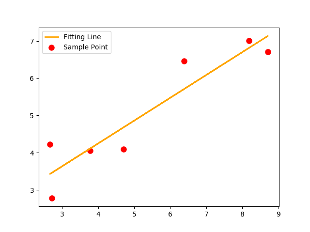

```python
import numpy as np
import matplotlib.pyplot as plt
from scipy.optimize import leastsq

# sample points
Xi=np.array([8.19,2.72,6.39,8.71,4.7,2.66,3.78])
Yi=np.array([7.01,2.78,6.47,6.71,4.1,4.23,4.05])

# fitting function
def func(p,x):
    k,b=p
    return k*x+b

# 这里的error函数和神经网络中常说的cost函数实际上是一回事，只不过这里更简单些而已
def error(p,x,y,s):
    print(s)
    return func(p,x)-y #x、y都是列表，故返回值也是个列表

# initial guest
p0=[100,2]
s="Test the number of iteration"

# fitting
para=leastsq(error,p0,args=(Xi,Yi,s))
k,b=para[0]
print('k=',k,';b=',b)

plt.plot(Xi,Yi,"ro",label="Sample Point",linewidth=3)
plt.plot(Xi,func(para[0],Xi),color="orange",label="Fitting Line",linewidth=2)
plt.legend()
plt.show()
```

for parabolic

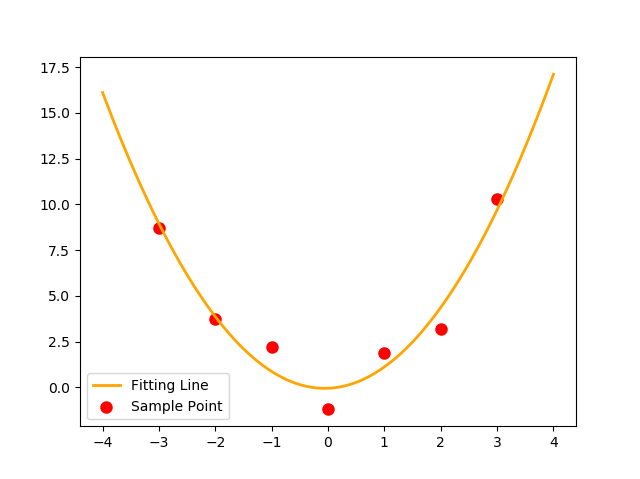

```python
import numpy as np
import matplotlib.pyplot as plt
from scipy.optimize import leastsq

# sample points
Xi=np.array([0,1,2,3,-1,-2,-3])
Yi=np.array([-1.21,1.9,3.2,10.3,2.2,3.71,8.7])

# fitting function
def func(p,x):
    a,b,c=p
    return a*x**2+b*x+c

# 这里的error函数和神经网络中常说的cost函数实际上是一回事，只不过这里更简单些而已
def error(p,x,y,s):
    print(s)
    return func(p,x)-y #x、y都是列表，故返回值也是个列表

# initial guest
p0=[1,1,1]
s="Test the number of iteration"

# fitting
para=leastsq(error,p0,args=(Xi,Yi,s))
a,b,c=para[0]
print('a=',c,';b=',b,';c=',c)

plt.scatter(Xi,Yi,color="red",label="Sample Point",linewidth=3)
x=np.linspace(-4,4,100)
plt.plot(x,func(para[0],x),color="orange",label="Fitting Line",linewidth=2)
plt.legend()
plt.show()
```

for sine

震荡类型的函数拟合需要配合FFT，才有很好的效果; 包括OriginLab也是这么干的；

下面例子用到的`scipy.optimize.curve_fit`其中采用的就是`scipy.optimize.least_squares`的算法

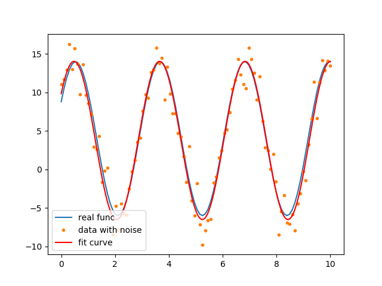

```python
import matplotlib.pyplot as plt
import numpy as np
from scipy.optimize import curve_fit

def fit_sin(tt, yy):
    '''Fit sin to the input time sequence, and return fitting parameters "amp", "omega", "phase", "offset", "freq", "period" and "fitfunc"'''
    ff = np.fft.fftfreq(len(tt), (tt[1]-tt[0])) # assuming uniform spacing
    Fyy = abs(np.fft.fft(yy))
    guess_freq = abs(ff[np.argmax(Fyy[1:])+1]) # excluding the zero frequency "peak", which is related to offset
    guess_amp = np.std(yy) * 2.**0.5
    guess_offset = np.mean(yy)
    guess = np.array([guess_amp, 2.*np.pi*guess_freq, 0., guess_offset])

    sinfunc=lambda t, A, w, p, c: A * np.sin(w*t + p) + c # :后面就是lambda的return
    popt, pcov = curve_fit(sinfunc, tt, yy, p0=guess)
    A, w, p, c = popt
    f = w/(2.*np.pi)
    fitfunc = lambda t: A * np.sin(w*t + p) + c
    return {"amp": A, "omega": w, "phase": p, "offset": c, "freq": f, "period": 1./f, "fitfunc": fitfunc, "maxcov": np.max(pcov), "rawres": (guess,popt,pcov)}


N, amp, omega, phase, offset, noise = 100, 10., 2., .5, 4., 2
x = np.linspace(0, 10, N)
y0 = amp*np.sin(omega*x + phase) + offset
y1 = y0 + noise*np.random.randn(len(x))

res = fit_sin(x, y1)
print( "Amplitude=%(amp)s, Angular freq.=%(omega)s, phase=%(phase)s, offset=%(offset)s, Max. Cov.=%(maxcov)s" % res )

plt.plot(x, y0, label="real func")
plt.plot(x, y1, ".", label="data with noise")

x2=np.linspace(0, 10, N*2)
plt.plot(x2, res["fitfunc"](x2), 'r', label="fit curve")
plt.legend()
plt.show()
```   


### `meshgrid`,`ogrid`, `mgrid`

`ogrid`, `mgrid`都是对`meshgrid`的封装; 推荐用`mgrid`

```python
# go to definition
mgrid = nd_grid(sparse=False)
ogrid = nd_grid(sparse=True)
```

```python
import numpy as np

x1, y1 = np.ogrid[-2:2, -2:2]
x2, y2 = np.mgrid[-3:1, -3:1]
print('ogrid return shape',x1.shape, y1.shape) # (4,1) (1,4)
print('mgrid return shape',x2.shape, y2.shape) # (4,4) (4,4)
print(x1)
print(y1)
# [[-2]
#  [-1]
#  [ 0]
#  [ 1]]
# [[-2 -1  0  1]]
print(x2)
print(y2)
# [[-3 -3 -3 -3]
#  [-2 -2 -2 -2]
#  [-1 -1 -1 -1]
#  [ 0  0  0  0]]
# [[-3 -2 -1  0]
#  [-3 -2 -1  0]
#  [-3 -2 -1  0]
#  [-3 -2 -1  0]]
```

### 3d scatter

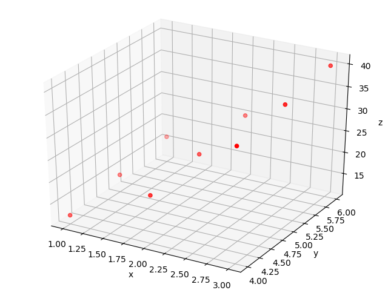

```python
import numpy as np
import matplotlib.pyplot as plt
from mpl_toolkits.mplot3d import Axes3D

# 必须用mgrid, 才能3d scatter
x1, y1 = np.mgrid[1:3:3j,4:6:3j]
z1=3*x1**2+2*y1+1

fig=plt.figure()
ax=Axes3D(fig)

ax.scatter(x1, y1, z1, c='red')
ax.set_xlabel('x')
ax.set_ylabel('y')
ax.set_zlabel('z')
plt.show()
```

### 3d surface

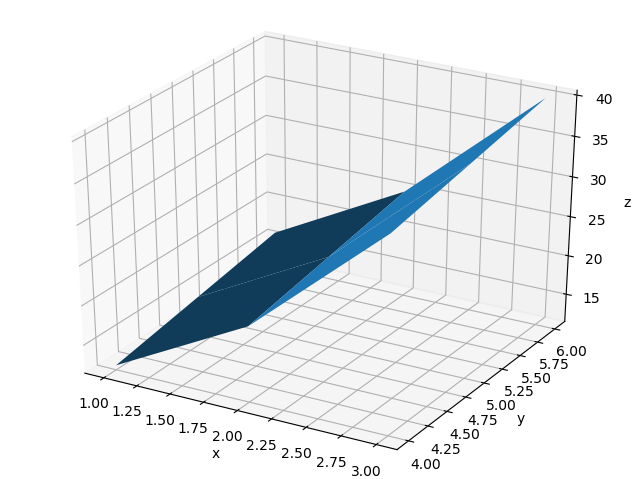

```python
import numpy as np
import matplotlib.pyplot as plt
from mpl_toolkits.mplot3d import Axes3D

x1, y1 = np.mgrid[1:3:3j,4:6:3j]
z1=3*x1**2+2*y1+1

fig=plt.figure()
ax=Axes3D(fig)

ax.plot_surface(x1, y1, z1)
ax.set_xlabel('x')
ax.set_ylabel('y')
ax.set_zlabel('z')
plt.show()
```

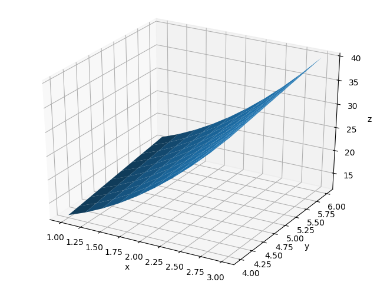

```python
import numpy as np
import matplotlib.pyplot as plt
from mpl_toolkits.mplot3d import Axes3D

# leastsq的本质也是将区间分的更细，得到更加接近的拟合参数
# 比如这里的10j
x1, y1 = np.mgrid[1:3:10j,4:6:10j]
z1=3*x1**2+2*y1+1

fig=plt.figure()
ax=Axes3D(fig)

ax.plot_surface(x1, y1, z1)
ax.set_xlabel('x')
ax.set_ylabel('y')
ax.set_zlabel('z')
plt.show()
```

for leastsq

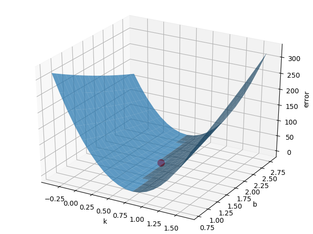

```python
import numpy as np
import matplotlib.pyplot as plt
from mpl_toolkits.mplot3d import Axes3D
from scipy.optimize import leastsq

# part1
Xi = np.array([8.12, 2.72, 6.39, 8.71, 4.7, 2.66, 3.78])
Yi = np.array([7.01, 2.78, 6.47, 6.71, 4.1, 4.23, 4.05])

def func(p, x):
    k, b = p
    return k*x+b

def error(p, x, y, s):
    print(s)
    return func(p, x)-y

p0 = [100, 2]
s = "Test the number of iteration"

para = leastsq(error, p0, args=(Xi, Yi, s))
k0, b0 = para[0]
print('k0=', k0, ';b0=', b0)

# part2
def calc_error(k, b):
    error_array = np.zeros(k.shape)
    for x, y in zip(Xi, Yi):
        error_array += (y-(k*x+b))**2
    return error_array

k, b = np.mgrid[k0-1:k0+1:20j, b0-1:b0+1:20j]
error_array = calc_error(k, b)

fig = plt.figure()
ax = Axes3D(fig)

ax.scatter(k0, b0, calc_error(k0, b0), c='red', s=100) # color='red', size=100
ax.plot_surface(k, b, error_array, alpha=0.7)
ax.set_xlabel('k')
ax.set_ylabel('b')
ax.set_zlabel('error')
plt.show()
```

## optimize's minimum

optimize库提供了几个求函数最小值的算法：`fmin, fmin_powell, fmin_cg, fmin_bfgs`

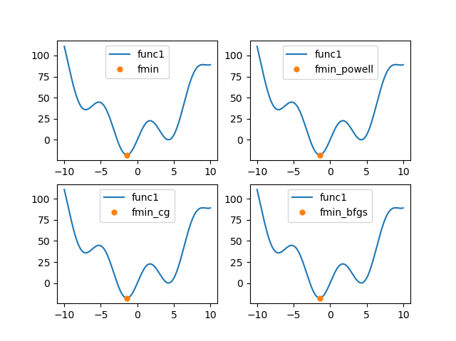

```python
import scipy.optimize as opt
import matplotlib.pyplot as plt
import numpy as np

func1=lambda x: x**2+20*np.sin(x)
# 从0开始找最小值
res1=opt.fmin(func1, 0)
res2=opt.fmin_powell(func1, 0)
res3=opt.fmin_cg(func1, 0)
res4=opt.fmin_bfgs(func1, 0)
res_array=[(res1[0], 'fmin'), (res2, 'fmin_powell'), (res3[0], 'fmin_cg'), (res4[0], 'fmin_bfgs')]

x=np.linspace(-10, 10, 500)
for i in range(4):
    plt.subplot(2,2,i+1)
    plt.plot(x, func1(x), label='func1')
    plt.plot(res_array[i][0], func1(res_array[i][0]), '.', markersize=10, label=res_array[i][1])
    plt.legend()

plt.show()
```

### minimum with convolution

对于一个离散的线性时不变系统h, 如果它的输入是x，那么其输出y可以用x和h的卷积表示：$y=x*h$

反卷积运算:

- 如果已知系统的输入x和输出y，如何计算系统的传递函数h；
- 如果已知系统的传递函数h和系统的输出y，如何计算系统的输入x。

反卷积运算，是十分困难的，特别是在实际的运用中，测量系统的输出总是存在误差的

用fmin计算反卷积，这种方法只能用在很小规模的数列之上，因此没有很大的实用价值，不过用来评价fmin函数的性能还是不错的

卷积: 延迟后叠加

- 如果是离散输入信号x, x整体依次与离散h中的每一个作用(h中的每一个都是一个权重)，并且每一次错开一个数；所以最终的序列长度为$xSize + hSize - 1$
- 换成连续的也是好理解的


$$
h\left( t \right) =\int_0^t{\delta \left( \tau -0 \right) d\tau \times h\left( t-\tau \right)}
$$

$$
y\left( t \right) =\int_0^t{f\left( \tau \right) d\tau \times h\left( t-\tau \right)}
$$

[Notes: ](https://www.zhihu.com/question/22102732/answer/369089156)

- Fourier series: 对周期信号转换
- Fourier Transform: 对非周期信号转换到**频域**
- Laplace Transform: 变换到**复域**，主要用于计算微分方程；卷积主要是在Laplace中
- Z Transform: 离散的Laplace变换，主要用于计算差分方程

```python
import numpy as np
import scipy.optimize as opt


def test_fmin_convolve(fmin_func, x, h, y, yn, hh):
    # 找到h0, 让其和yn最接近；也就是最接近实际情况的单位响应
    h0 = fmin_func(lambda hh: np.sum((yn-np.convolve(x, hh))**2), hh)
    print(fmin_func.__name__)
    print("="*30)
    # 这里的np.convolve(x, h0)几乎与yn接近
    print('y error:', np.sum((np.convolve(x, h0)-y)**2)/np.sum(y**2))
    print('h error:', np.sum((h0-h)**2)/np.sum(h**2))
    print('\n')


def test_n(x_size, h_size, noise):
    # y=x*h
    # x是输入信号, h是信号系统(本质上h就是单位响应), y是响应
    x = np.random.rand(x_size)
    h = np.random.rand(h_size)
    y = np.convolve(x, h)  # shpae is x_size+h_size-1

    # 目的: 已知响应yn和x, 找到一个最佳的h0;
    # 从hh开始找
    yn = y+noise*np.random.randn(len(y))
    hh = np.random.rand(h_size)

    test_fmin_convolve(opt.fmin, x, h, y, yn, hh)
    test_fmin_convolve(opt.fmin_powell, x, h, y, yn, hh)
    test_fmin_convolve(opt.fmin_cg, x, h, y, yn, hh)
    test_fmin_convolve(opt.fmin_bfgs, x, h, y, yn, hh)


if __name__ == '__main__':
    test_n(200, 20, 0.1)
```

## Nonlinear equations

$$
\begin{cases}
	5x_1+3=0\\
	4x_{0}^{2}-\text{2}\sin \left( x_1x_2 \right) =0\\
	x_1x_2-1.5=0\\
\end{cases}
$$

在对方程组进行求解时，`fsolve`会自动计算方程组的雅可比矩阵

```python
import math
import scipy.optimize as opt


def func(x):
    # initial value
    x0 = float(x[0])
    x1 = float(x[1])
    x2 = float(x[2])
    return [5*x1+3, 4*x0*x0-2*math.sin(x1*x2), x1*x2-1.5]


res = opt.fsolve(func, [1, 1, 1])
print('x0=', res[0], ';x1=', res[1], ';x2=', res[2])
# x0= -0.706220569866 ;x1= -0.6 ;x2= -2.5
print(func(res))
# [0.0, -9.126033262418787e-14, 5.329070518200751e-15]
```

通过Jacobian matrix来提高效率(方程总未知数很多，但是每个方程中的未知数较少，稀疏Jacobi)

Jacobian matrix:

$$
\left[ \begin{matrix}
	\frac{\partial f1}{\partial u1}&		\frac{\partial f1}{\partial u2}&		\frac{\partial f1}{\partial u3}\\
	\frac{\partial f2}{\partial u1}&		\frac{\partial f2}{\partial u2}&		\frac{\partial f2}{\partial u3}\\
	\frac{\partial f3}{\partial u1}&		\frac{\partial f3}{\partial u2}&		\frac{\partial f3}{\partial u3}\\
\end{matrix} \right] 
$$


```python
import math
import scipy.optimize as opt


def func(x):
    # initial value
    x0 = float(x[0])
    x1 = float(x[1])
    x2 = float(x[2])
    return [5*x1+3, 4*x0*x0-2*math.sin(x1*x2), x1*x2-1.5]


def j(x):
    # initial value
    x0 = float(x[0])
    x1 = float(x[1])
    x2 = float(x[2])
    return [
        [0, 5, 0],
        [8*x0, -2*x2*math.cos(x1*x2), -2*x1*math.cos(x1*x2)],
        [0, x2, x1]
    ]


res = opt.fsolve(func, [1, 1, 1], fprime=j)
print('x0=', res[0], ';x1=', res[1], ';x2=', res[2])
# x0= -0.706220569866 ;x1= -0.6 ;x2= -2.5
print(func(res))
# [0.0, -9.126033262418787e-14, 5.329070518200751e-15]
```

## interpolate

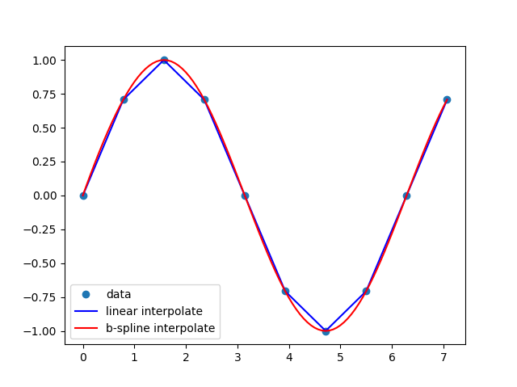

```python
from scipy import interpolate
import numpy as np
import pylab as plt

x = np.linspace(0, 2.25*np.pi, 10)
y = np.sin(x)

# linear interpolate
f_linear = interpolate.interp1d(x, y)
# B-Spline interpolate
x_new = np.linspace(0, 2.25*np.pi, 100)
tck = interpolate.splrep(x, y)
y_bspline = interpolate.splev(x_new, tck)

plt.plot(x, y, 'o', label='data')
plt.plot(x_new, f_linear(x_new), 'b', label='linear interpolate')
plt.plot(x_new, y_bspline, 'r', label='b-spline interpolate')
plt.legend()
plt.show()
```

## Numerical integration

### 1d integration

```python
import numpy as np
from scipy import integrate


def half_circle(i): return (1-i**2)**0.5


# method 1, 小矩形面积求和
N = 10000
x = np.linspace(-1, 1, N)
dx = 2.0/N
y = half_circle(x)
print('method1: half_area=', dx*np.sum(y))

# method2, 折线下的面积，更加准确 np.trapz
print('method2: half_area=', np.trapz(y, x))

# method3, 直接使用scipy的lib, 最准确
res, err = integrate.quad(half_circle, -1, 1)
print('method3: half_area=', res, ';error=', err)
print('for comparing:pi/2=', np.pi/2)
```

### Double integral

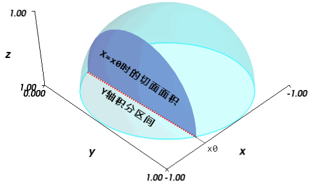

```python
import numpy as np
from scipy import integrate

def half_circle(i): return (1-i**2)**0.5
def half_sphere(i, j): return (1-i**2-j**2)**0.5

# 二重积分
res, err = integrate.dblquad(half_sphere, -1, 1, lambda x: -half_circle(x), lambda x: half_circle(x))
print('res=', res, ';err=', err)
# for comparing
print('res=', 2*np.pi/3)
```

### Triple integral

```python
import numpy as np
from scipy import integrate

def sphere(i, j, k): return 1
def half_circle(i): return (1-i**2)**0.5
def half_sphere(i, j): return (1-i**2-j**2)**0.5

# 三重积分sphere
res, err = integrate.tplquad(sphere,
                             -1, 1,
                             lambda x: -half_circle(x), lambda x: half_circle(x),
                             lambda x, y: -half_sphere(x, y), lambda x, y: half_sphere(x, y))
print('res=', res, ';err=', err)
# for comparing
print('res=', 4*np.pi/3)
```

## ODE(Ordinary differential equations)

### First-order equations

$$
\begin{cases}
	\frac{dy}{dx}=x-y\\
	y\left( 0 \right) =1\\
\end{cases}
$$

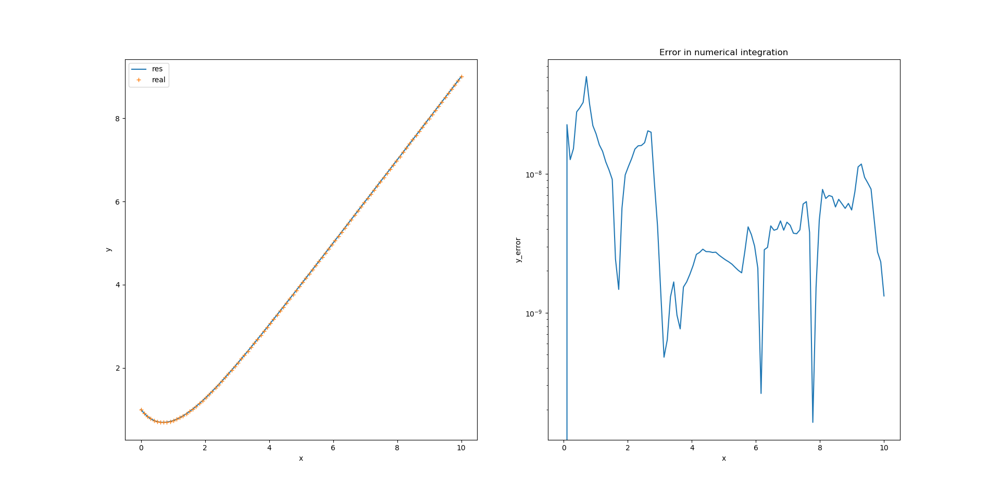

```python
import pylab as plt
import numpy as np
from scipy import integrate


def dy_dx(y, x): return x-y


x = np.linspace(0, 10, 100)
y0 = 1.0
ys = integrate.odeint(dy_dx, y0, x)  # shape is (100, 1)
y = ys[:, 0]  # shpae is (100,);或者使用squeeze

# show result
plt.subplot(121)
plt.xlabel('x')
plt.ylabel('y')
plt.plot(x, y, label='res')
# 解析解形式
y_exact = x-1+2*np.exp(-1*x)
plt.plot(x, y_exact, '+', label='real')
plt.legend()

# show err
plt.subplot(122)
plt.xlabel('x')
plt.ylabel('y_error')
plt.semilogy(x, np.abs(y_exact-y))
plt.title('Error in numerical integration')

plt.show()
```

### Second-order ODEs

$$
\begin{cases}
	y''+2y'+2y=\cos \left( 2x \right)\\
	y\left( 0 \right) =0\\
	y'\left( 0 \right) =0\\
\end{cases}
$$

in order to solve, turn it to

$$
\begin{cases}
	y'=z\\
	z'=-2z-2y+\cos \left( 2x \right)\\
	y\left( 0 \right) =0\\
	z\left( 0 \right) =0\\
\end{cases}
$$

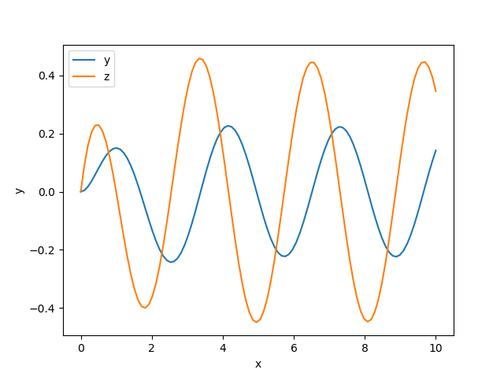

```python
import pylab as plt
import numpy as np
from scipy import integrate


def dU_dx(U, x):
    # y=U[0], z=U[1]
    # This function should return [y', z']
    y, z = U
    return [z, -2*z-2*y+np.cos(2*x)]

# y(0)=0, z(0)=0
U0 = [0, 0]
x = np.linspace(0, 10, 100)
U = integrate.odeint(dU_dx, U0, x)  # shape is (100, 2)

plt.xlabel('x')
plt.ylabel('y')
plt.plot(x, U[:, 0], label='y')
plt.plot(x, U[:, 1], label='z')
plt.legend()
plt.show()
```

### time-dependent equations

[Lotka–Volterra equations](https://en.wikipedia.org/wiki/Lotka%E2%80%93Volterra_equations) is a **first-order non-linear ordinary differential equations**


$$
\begin{cases}
	\frac{dx}{dt}=x\left( a-b*y \right)\\
	\frac{dy}{dt}=-y\left( c-d*x \right)\\
	a=b=c=d=1\\
\end{cases}
$$

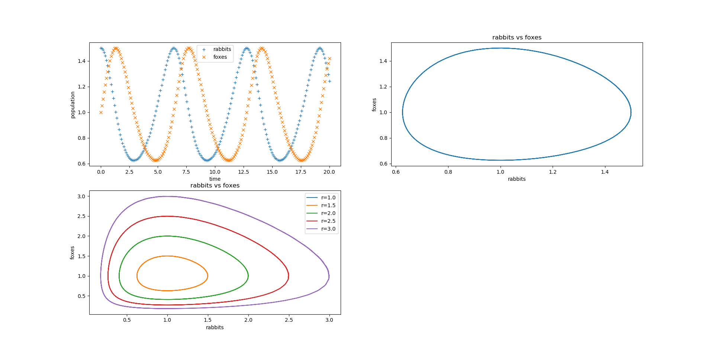

```python
import pylab as plt
import numpy as np
from scipy import integrate

a, b, c, d = 1, 1, 1, 1


def dP_dt(P, t):
    x, y = P
    return [x*(a-b*y), -y*(c-d*x)]


t = np.linspace(0, 20, 200)
P0 = [1.5, 1.0]
P = integrate.odeint(dP_dt, P0, t)
x = P[:, 0]
y = P[:, 1]

plt.subplot(221)
plt.plot(t, x, '+', label='rabbits')
plt.plot(t, y, 'x', label='foxes')
plt.xlabel('time')
plt.ylabel('population')
plt.legend()

plt.subplot(222)
plt.plot(x, y)
plt.xlabel('rabbits')
plt.ylabel('foxes')
plt.title('rabbits vs foxes')

plt.subplot(223)
ic = np.linspace(1, 3, 5)
for r in ic:
    P0 = [r, 1.0]
    P = integrate.odeint(dP_dt, P0, t)
    plt.plot(P[:, 0], P[:, 1], label=f'r={r}')
plt.xlabel('rabbits')
plt.ylabel('foxes')
plt.title('rabbits vs foxes')
plt.legend()

plt.show()
```

[Lorentz attractor](https://en.wikipedia.org/wiki/Lorenz_system)

当参数为某些值时，轨迹出现馄饨现象：即微小的初值差别也会显著地影响运动轨迹

$$
\begin{cases}
	\frac{dx}{dt}=\sigma \left( y-x \right)\\
	\frac{dy}{dt}=x\left( \rho -z \right) -y\\
	\frac{dz}{dt}=xy-\beta z\\
\end{cases}
$$

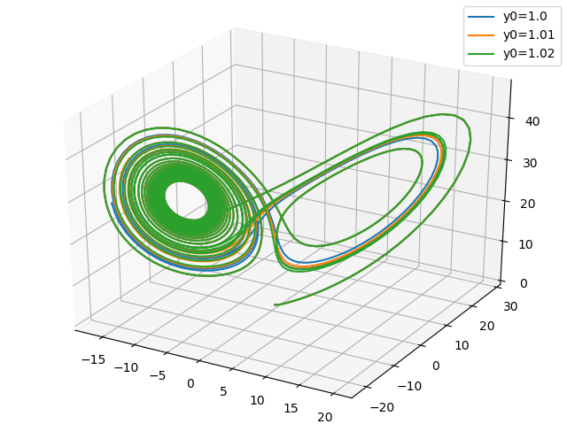

```python
import pylab as plt
from mpl_toolkits.mplot3d import Axes3D
import numpy as np
from scipy import integrate


def dP_dt(P, t, s, r, b):
    x, y, z = P
    # 为了提高效率，用了np.array()
    return np.array([s*(y-x), x*(r-z)-y, x*y-b*z])


fig = plt.figure()
ax = Axes3D(fig)

t = np.arange(0, 20, 0.01)
ic = np.array([1.00, 1.01, 1.02])
for yi in ic:
    P0 = [0.0, yi,  0.0]
    # 让参数 s, r, b=10, 28, 3
    P = integrate.odeint(dP_dt, P0, t, args=(10, 28, 3))
    x = P[:, 0]
    y = P[:, 1]
    z = P[:, 2]
    ax.plot(x, y, z, label=f'y0={yi}')

plt.legend()
plt.show()
```

## Filter

信号处理

[code](http://bigsec.net/b52/scipydoc/example_scipy_signal.html)

pass

## Python3 with C/C++

高度优化的函数库(Numpy, Scipy)无法实现我们的算法，必须从头开始写循环

python2采用scipy的`weave`; python3采用`numba`

```python
from numba import jit
import numpy as np
import time


@jit
def numda_sum(arr):
    n = len(arr)
    res = 0
    for i in range(n):
        res += arr[i]
    return res


a = np.arange(0, 10000000, 1.0)

start = time.clock()
for i in range(100):
    numda_sum(a)
print("my_sum:", (time.clock() - start) / 100.0)

start = time.clock()
for i in range(100):
    np.sum(a)  # numpy中的sum，其实现也是C语言级别
print("np.sum:", (time.clock() - start) / 100.0)

start = time.clock()
print(sum(a))  # Python内部函数sum通过数组a的迭代接口访问其每个元素，因此速度很慢
print("sum:", time.clock() - start)
```

```bash
# output
my_sum: 0.015312611250049443
np.sum: 0.012138009839115487
4.9999995e+13
sum: 0.8169488075328037
```