# matplotlib

- [matplotlib](#matplotlib)
  - [Architecture](#architecture)
  - [Some Examples](#some-examples)
  - [Format Strings](#format-strings)
  - [set and get object properties](#set-and-get-object-properties)
  - [subplot](#subplot)
  - [matplot config](#matplot-config)
  - [Artist Object](#artist-object)
    - [Artist property](#artist-property)
  - [Figure](#figure)
  - [Axes](#axes)
  - [Axis](#axis)
  - [Example](#example)
  - [Animation](#animation)

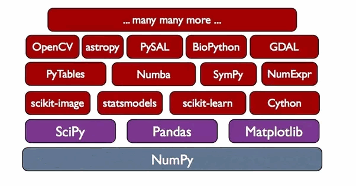

[matplotlib](https://matplotlib.org/gallery.html)是python最著名的绘图库，它提供了一整套和matlab相似的命令API; 还有一个`pylab`适合ipython下使用

## Architecture

- Backend: 将图显示在哪里
- Artist: 图显示成什么样子
- Scripting: pyplot, python api

## Some Examples


```python
import numpy as np
import matplotlib.pyplot as plt

x=np.arange(0, 10, 0.1)
y1=np.sin(x)
y2=np.sin(x-np.pi)
plt.plot(x, y1, label='sin(x)')
plt.plot(x, y2, label='sin(x-pi)')
plt.legend()

plt.show()
```

```python
import math
import numpy as np
import matplotlib.pyplot as plt

x = list(np.arange(0, 10, 0.1))

y1 = list(map(math.sin, x))
y2 = list(map(lambda v: math.sin(v-math.pi), x))

plt.plot(x, y1, label="sin(x)")
plt.plot(x, y2, label="sin(x-pi)")
plt.legend()

plt.show()
```


```python
import numpy as np
import pylab as plt
from matplotlib import cm
from mpl_toolkits.mplot3d import Axes3D

fig = plt.figure(1)
ax = Axes3D(fig)

[x, t] = np.mgrid[0:1:20j, -3*np.pi:10*np.pi:300j]

p = 0.5*np.pi*np.exp(-t/(9*np.pi))
u = 1 - 0.5*(1 - np.mod(3.6*t, 2*np.pi) / np.pi)**4
y = 2*np.sin(p)*(x**2 - x)**2
r = u * (x*np.sin(p) + y*np.cos(p))

# to x, y, z
xx = r * np.cos(t)
yy = r * np.sin(t)
zz = u * (x * np.cos(p) - y * np.sin(p))

ax.plot_surface(xx, yy, zz, cmap=cm.pink, rstride=1, cstride=1)
plt.show()
```

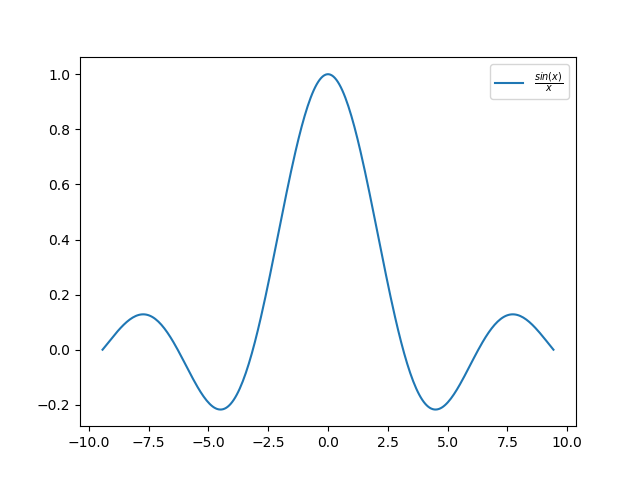

```python
import numpy as np
import matplotlib.pyplot as plt

x = np.linspace(-3*np.pi, 3*np.pi, 300)
y = np.sin(x)/x

# 支持LaTex, 注意转义字符
plt.plot(x, y, label=r'$\frac{sin(x)}{x}$')
plt.legend()
plt.show()
```

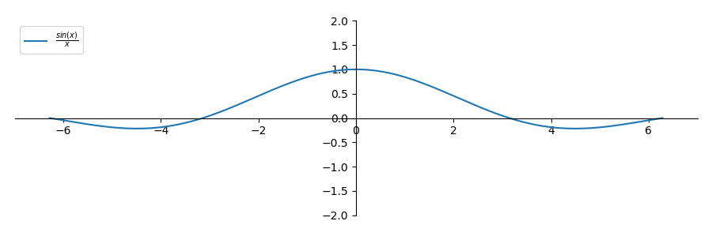

```python
import numpy as np
import matplotlib.pyplot as plt

x = np.linspace(-2*np.pi, 2*np.pi, 300)
y = np.sin(x)/x

fig = plt.figure(figsize=(9, 3)) # default=(6.4, 4.8) inch
ax = fig.add_subplot(1,1,1)
ax.plot(x, y, label=r'$\frac{sin(x)}{x}$')

# axes是坐标系, axis是坐标轴

# 移动坐标轴
ax.spines['left'].set_position('zero')
ax.spines['right'].set_color('none')
ax.spines['bottom'].set_position('zero')
ax.spines['top'].set_color('none')

# 横纵轴scale一样
ax.axis('scaled')
ax.axis([-7, 7, -2, 2])

ax.legend(loc='upper left')
# 紧凑的subplot排列
plt.tight_layout()
plt.show()
```


```python
import numpy as np
import pylab as plt
import matplotlib

x = np.arange(0, 5, 0.01)
y1 = np.sin(x**2)
y2 = np.cos(x)

# 类似全局设置，一般用不上
matplotlib.rc('lines', linewidth=3, linestyle='--')

plt.plot(x, y1, label=r'$sin(x^2)$')
plt.plot(x, y2, '-', label='cos(x)')

plt.legend()
plt.show()
```


```python
import numpy as np
import pylab as plt

x = np.linspace(0, 5, 200)
y1 = np.sin(x)
y2 = np.cos(x**2)

plt.figure(figsize=(6, 8))

plt.subplot(211)
plt.plot(x, y1, color='r', linewidth=2, label='$sin(x)$')
plt.plot(x, y2, 'g--', label='$cos(x^2)$')
plt.title('pylab first example')
plt.xlabel('x')
plt.ylabel('y')
plt.axis('scaled')
plt.xlim(0, 5)
plt.ylim(-1.5, 1.5)
plt.legend(loc='lower left')

plt.subplot(212)
plt.plot(x, y1, c='r', lw=2, label='$sin(x)$')
plt.plot(x, y2, 'g--', label='$cos(x^2)$')
plt.axis('scaled')
plt.axis([0, 5, -1.5, 1.5])
plt.show()
```

example: `subplots`

```py
import numpy as np
import pylab as plt

fig, ax=plt.subplots()
ax.plot([1, 2, 3, 4, 5])
plt.show()
```

```py
import numpy as np
import pylab as plt

fig, ax=plt.subplots(2, 1)
ax[0].plot([1, 2, 3])
ax[1].plot([11, 22, 33])
plt.show()
```

```py
import numpy as np
import pylab as plt

fig, ax=plt.subplots(2, 2)
ax[0][0].plot([1, 2, 3])
ax[1][1].plot([11, 22, 33])
plt.show()
```


[QT5 coordinate system](http://doc.qt.io/qt-5/application-windows.html#window-geometry)

```python
import numpy as np
import pylab as plt
import matplotlib

x = np.linspace(0, 5, 200)
y1 = np.sin(x)
y2 = np.cos(x**2)

# 点击按钮，保存的图片的dpi
matplotlib.rcParams["savefig.dpi"]=300 # (2400px, 1200px)

# 这个dpi=100只是显示的dpi; 
# 多个绘图窗口需要添加第一序号参数;
plt.figure(1, dpi=100, figsize=(8, 4)) # (800px, 400px)
plt.plot(x, y1)
plt.get_current_fig_manager().window.move(0, 0)

# 第二个窗口；如果第二个窗口已经存在，那么该窗口get focus
plt.figure(2)
plt.plot(x, y2)
plt.get_current_fig_manager().window.setGeometry(0, 500, 480, 360)

# 现在matplotlib的backends(matplotlib.get_backend())是QT5Agg;
# 所以绘制图片底层用的是QT5, 要求安装PyQt5
# 包括前面的window.move(), window.setGeometry()都是Qt5里面的函数；以及后面的plt.show()
# move()和setGeometry()的x,y还有差别，参见上面的链接
plt.show()
```

查看格式化参数，比如`b--`: IPython中输入`plt.plot?`


```python
import numpy as np
import pylab as plt
import matplotlib

x = np.linspace(0, 3, 100)
fig, axs = plt.subplots(figsize=(4, 4))
line = matplotlib.lines.Line2D(x, x**2)
# 因为没有指定subplot的行列，所以axs只有一个
axs.add_line(line)
axs.axis([0, 3, 0, 3])
plt.show()
```

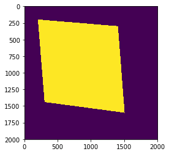

```python
import numpy as np
import matplotlib.pyplot as plt
from matplotlib.path import 

width, height=2000, 2000

polygon=[(0.1*width, 0.1*height), (0.15*width, 0.7*height), (0.8*width, 0.75*height), (0.72*width, 0.15*height)]
poly_path=Path(polygon)

x, y = np.mgrid[:height, :width]
coors=np.hstack((x.reshape(-1, 1), y.reshape(-1,1))) # coors.shape is (4000000,2)

mask = poly_path.contains_points(coors)

plt.imshow(mask.reshape(height, width))
plt.savefig('Figure_7.png', bbox_inches = 'tight')
```

## Format Strings

Colors

| character | color   |
| --------- | ------- |
| 'b'       | blue    |
| 'g'       | green   |
| 'r'       | red     |
| 'c'       | cyan    |
| 'm'       | magenta |
| 'y'       | yellow  |
| 'k'       | black   |
| 'w'       | white   |

Markers

| character | description           |
| --------- | --------------------- |
| '.'       | point marker          |
| ','       | pixel marker          |
| 'o'       | circle marker         |
| 'v'       | triangle_down marker  |
| '^'       | triangle_up marker    |
| '<'       | triangle_left marker  |
| '>'       | triangle_right marker |
| '1'       | tri_down marker       |
| '2'       | tri_up marker         |
| '3'       | tri_left marker       |
| '4'       | tri_right marker      |
| 's'       | square marker         |
| 'p'       | pentagon marker       |
| '*'       | star marker           |
| 'h'       | hexagon1 marker       |
| 'H'       | hexagon2 marker       |
| '+'       | plus marker           |
| 'x'       | x marker              |
| 'D'       | diamond marker        |
| 'd'       | thin_diamond marker   |
| '\| '     | vline marker          |
| '_'       | hline marker          |

Line Styles

| character | description         |
| --------- | ------------------- |
| '-'       | solid line style    |
| '--'      | dashed line style   |
| '-.'      | dash-dot line style |
| ':'       | dotted line style   |

##  set and get object properties

matplotlib所绘制的图的每个组成部分都对应有一个对象，我们可以通过调用这些对象的属性设置方法`set_*`或者pyplot的属性设置函数`setp`设置其属性值

```python
import numpy as np
import pylab as plt

x=np.arange(0,np.pi,0.1)
# method1, plot返回一个列表，通过line,获取其第一个元素
line1,=plt.plot(x, x*x)
print(line1.get_linewidth()) # 1.5
line1.set_label('$x^2$')

# method2
lines=plt.plot(x, np.sin(x), x, np.cos(x))
# 同时设置两个line的属性
plt.setp(lines, c='orange', linewidth=2)
# getp: 指定属性名：返回对象的指定属性的值
print(plt.getp(lines[0], 'color')) # orange
# getp: 不指定属性名：打印出对象的所有属性和其值
print(plt.getp(lines[1]))

plt.legend()
plt.show()
```

```python
import numpy as np
import pylab as plt

x = np.arange(0, 5, 0.1)
plt.plot(x, x**2)

fig = plt.gcf()
print('fig=', fig)
print('='*40)
plt.getp(fig)

print('='*80)
ax = plt.gca()
print('ax=', ax)
print('='*40)
plt.getp(ax)
```

```python
# get children
import numpy as np
import pylab as plt

x = np.arange(0, 5, 0.1)
plt.plot(x, x**2)

# 或者调用plt.figure()返回一个fig
fig = plt.gcf()
print('fig=', fig)
print('='*40)
plt.getp(fig)

print('='*80)
ax1 = plt.getp(fig, 'children')[1]
ax2 = plt.gca()
print('ax1=', ax1)
print('ax2=', ax2)
# ax1= AxesSubplot(0.125,0.11;0.775x0.77)
# ax2= AxesSubplot(0.125,0.11;0.775x0.77)
```

## subplot

多个坐标系(axes): `subplot(numRows, numCols, plotNum)`

如果numRows，numCols和plotNum这三个数都小于10的话，可以把它们缩写为一个整数，例如subplot(323)和subplot(3,2,3)是相同的。subplot在plotNum指定的区域中创建一个轴对象。如果新创建的轴和之前创建的轴重叠的话，之前的轴将被删除


```python
import numpy as np
import pylab as plt

for idx, color in enumerate("rgbyck"):
    plt.subplot(321+idx, facecolor=color)
plt.show()
```

特殊的形状subplot


```python
import numpy as np
import pylab as plt

plt.subplot(221)
plt.subplot(222)
plt.subplot(212)
plt.show()
```

可以在弹出窗口中调节不同的axes; 或者在程序中用`subplots_adjust()`


```python
import numpy as np
import pylab as plt

plt.subplot(221)
plt.subplot(222)
plt.subplot(223)
plt.subplot(224)
plt.subplots_adjust(left=0.05, right=0.95, top=0.95, bottom=0.05, hspace=0.1, wspace=0.2)
plt.show()
```

## matplot config

Matplotlib 使用配置文件 matplotlibrc 时的搜索顺序如下：

- 当前路径 : 程序的当前路径
- 用户配置路径 : 通常为 HOME/.matplotlib/，可以通过环境变量MATPLOTLIBRC修改
- 系统配置路径 : 保存在 matplotlib的安装目录下的 mpl-data 下

```python
import matplotlib
import os

print(os.getcwd())
print(matplotlib.get_configdir())
# 因为当前路径和用户配置路径都没有matplotlibrc文件，所以最后一定是去了系统配置目录
print(matplotlib.matplotlib_fname())
```

```bash
# output
I:\New folder\Sci
C:\Users\Administrator\.matplotlib
D:\ProgrammingTools\Anaconda3\lib\site-packages\matplotlib\mpl-data\matplotlibrc
```

如果将`matplotliblibrc`文件复制到当前路径，那么`matplotlib.matplotlib_fname()`返回的就是当前路径

配置文件的读入可以使用`plt.rc_params()`函数，它返回一个配置字典; 在matplotlib模块载入的时候会调用`plt.rc_params()`，并把得到的配置字典保存到`rcParams`变量中；matplotlib将使用`rcParams`中的配置进行绘图；

修改`rcParams`字典的数据来影响绘图:

- `matplotlib.rcParams["lines.marker"] = "o"`
- `matplotlib.rc("lines", marker="x", linewidth=2, color="red")`

恢复到默认配置: `matplotlib.rcdefaults()`

## Artist Object

matplotlib API包含有三层：

- backend_bases.FigureCanvas : 图表的绘制领域
- backend_bases.Renderer : 知道如何在FigureCanvas上如何绘图
- artist.Artist : 知道如何使用Renderer在FigureCanvas上绘图

FigureCanvas和Renderer需要处理底层的绘图操作, Artist则处理所有的高层结构，例如处理图表、文字和曲线等的绘制和布局

Artists分为**简单类型**和**容器类型**两种:

- 简单类型的Artists为标准的绘图元件，例如Line2D、 Rectangle、 Text、AxesImage 等等
- 容器类型则可以包含许多简单类型的Artists，使它们组织成一个整体，例如Axis、 Axes、Figure等

直接使用Artists创建图表的标准流程如下：

- 创建Figure对象
- 用Figure对象创建一个或者多个Axes或者Subplot对象
- 调用Axies等对象的方法创建各种简单类型的Artists


```python
import numpy as np
import pylab as plt

x=np.arange(0, 3, 0.1)

fig=plt.figure()
# left bottom width height
ax = fig.add_axes([0.2, 0.1, 0.7, 0.3])
ax.set_xlabel('x')
ax.set_ylabel('y')
line1,line2 =ax.plot(x, x**2, x, x**3)
# ax.lines是一个为包含ax的所有曲线的列表
print(ax.lines[0]) # Line2D(_line0)
print(line1) # Line2D(_line0)
plt.show()
```

通过查看`set_xlabel()`的源码，查看属性；并且可以`get_`


### Artist property

图表中的每个元素都用一个matplotlib的Artist对象表示，而每个Artist对象都有一大堆属性控制其显示效果

Figure对象和Axes对象都有patch属性作为其背景，它的值是一个Rectangle对象

```python
In [1]: import pylab as plt

In [2]: fig=plt.figure()

In [3]: plt.getp(fig)
    agg_filter = None
    alpha = None
    animated = False
    axes = []
    children = [<matplotlib.patches.Rectangle object at 0x0000020...
    clip_box = None
    clip_on = True
    clip_path = None
    constrained_layout = False
    constrained_layout_pads = (0.04167, 0.04167, 0.02, 0.02)
    contains = None
    default_bbox_extra_artists = []
    dpi = 100.0
    edgecolor = (1.0, 1.0, 1.0, 1)
    facecolor = (1.0, 1.0, 1.0, 1)
    figheight = 4.8
    figure = None
    figwidth = 6.4
    frameon = True
    gid = None
    label =
    path_effects = []
    picker = None
    rasterized = None
    size_inches = [ 6.4  4.8]
    sketch_params = None
    snap = None
    tight_layout = False
    transform = IdentityTransform()
    transformed_clip_path_and_affine = (None, None)
    url = None
    visible = True
    window_extent = TransformedBbox(     Bbox(x0=0.0, y0=0.0, x1=6.4, ...
    zorder = 0

In [4]: plt.getp(fig, 'children')
Out[4]: [<matplotlib.patches.Rectangle at 0x207fdb1ed68>]

In [5]: fig.patch
Out[5]: <matplotlib.patches.Rectangle at 0x207fdb1ed68>

In [6]: fig.show()

In [7]: fig.patch.set_color('g')

In [8]: fig.canvas.draw()

In [9]: plt.getp(fig.patch)
    aa = False
    agg_filter = None
    alpha = None
    animated = False
    antialiased or aa = False
    bbox = Bbox(x0=0.0, y0=0.0, x1=1.0, y1=1.0)
    capstyle = butt
    children = []
    clip_box = None
    clip_on = True
    clip_path = None
    contains = None
    data_transform = BboxTransformTo(     TransformedBbox(         Bbox...
    ec = (0.0, 0.5, 0.0, 1)
    edgecolor or ec = (0.0, 0.5, 0.0, 1)
    extents = Bbox(x0=0.0, y0=0.0, x1=640.0, y1=479.0)
    facecolor or fc = (0.0, 0.5, 0.0, 1)
    fc = (0.0, 0.5, 0.0, 1)
    figure = Figure(640x479)
    fill = True
    gid = None
    hatch = None
    height = 1
    joinstyle = miter
    label =
    linestyle or ls = solid
    linewidth or lw = 0.0
    ls = solid
    lw = 0.0
    patch_transform = CompositeGenericTransform(     BboxTransformTo(   ...
    path = Path(array([[ 0.,  0.],        [ 1.,  0.],        ...
    path_effects = []
    picker = None
    rasterized = None
    sketch_params = None
    snap = None
    transform = CompositeGenericTransform(     CompositeGenericTra...
    transformed_clip_path_and_affine = (None, None)
    url = None
    verts = [[   0.    0.]  [ 640.    0.]  [ 640.  479.]  [   ...
    visible = True
    width = 1
    window_extent = Bbox(x0=0.0, y0=0.0, x1=640.0, y1=479.0)
    x = 0
    xy = (0, 0)
    y = 0
    zorder = 1
```

## Figure

通过调用add_subplot或者add_axes方法往图表中添加子图(坐标系)，这些子图都将添加到Figure.axes属性中

```python
import numpy as np
import pylab as plt

fig = plt.figure()
print(plt.getp(fig, 'axes'))
ax1=fig.add_subplot(211) # 返回值是一个AxesSubplot类型数据，本质是Axes的子类
ax1.set_ylabel('ax1')
ax2=fig.add_axes([0.1,0.1,0.7,0.3])
ax2.set_ylabel('ax2')
print(plt.getp(fig, 'axes'))
plt.delaxes() # 如果不指定删除哪一个axes, 那么默认删除当前的axes
print(plt.getp(fig, 'axes'))

# plt.show()
```

```bash
# output
[]
# add_subplot,add_axes两种返回值类型不同
[<matplotlib.axes._subplots.AxesSubplot object at 0x000002868B3EDA90>, <matplotlib.axes._axes.Axes object at 0x000002868B50DD68>]
[<matplotlib.axes._subplots.AxesSubplot object at 0x000002868B3EDA90>]
```

为了支持pylab中的gca()等函数，Figure对象内部保存有当前轴的信息，因此不建议直接对Figure.axes属性进行列表操作，而应该使用add_subplot, add_axes, delaxes等方法进行添加和删除操作。

但是使用for循环对axes中的每个元素进行操作是没有问题的，下面的语句打开所有子图的栅格。


```python
import numpy as np
import pylab as plt

fig = plt.figure()
ax1=fig.add_subplot(211) # 返回值是一个AxesSubplot类型数据，本质是Axes的子类
ax1.set_ylabel('ax1')
ax2=fig.add_axes([0.1,0.1,0.7,0.3])
ax2.set_ylabel('ax2')
for ax in fig.axes:
    ax.grid(True)

plt.show()
```


```python
import numpy as np
import pylab as plt
from matplotlib.lines import Line2D

x=np.arange(0,5,0.01)

fig=plt.figure() # 最简单的Figure对象, 左下角坐标为(0,0),右上角为(1,1)
# 为了让所创建的Line2D对象使用fig的坐标，用了transform
line1=Line2D(x,x**2,color='r', figure=fig, transform=fig.transFigure)
line2=Line2D(x,x**3,color='g', figure=fig, transform=fig.transFigure)

fig.lines.extend([line1, line2])
plt.show()
```

Figure对象有如下属性包含其它的Artist对象：

- axes : Axes对象列表
- patch : 作为背景的Rectangle对象
- images : FigureImage对象列表，用来显示图片
- legends : Legend对象列表
- lines : Line2D对象列表
- patches : patch对象列表
- texts : Text对象列表，用来显示文字


## Axes

Axes对象是放在Figure对象里面的；


```python
import numpy as np
import pylab as plt
from matplotlib.lines import Line2D

x=np.arange(0,5,0.01)

fig=plt.figure()
fig.patch.set_color('g')
fig.patch.set_alpha(0.5)
ax=fig.add_axes([0.1,0.1,0.7,0.3])
ax.patch.set(color='r', alpha=0.5)

plt.show()
```

```python
In [1]: import numpy as np

In [2]: import pylab as plt

In [3]: x=np.arange(0,5,0.1)

In [4]: fig=plt.figure()

In [5]: ax=fig.add_subplot(111)

In [6]: line1,line2=ax.plot(x,x**2,x,x**3)

# fig.show()不会卡住
# plt.show()会卡住
In [7]: fig.show()

In [8]: plt.getp(ax)
    adjustable = box
    agg_filter = None
    alpha = None
    anchor = C
    animated = False
    aspect = auto
    autoscale_on = True
    autoscalex_on = True
    autoscaley_on = True
    axes_locator = None
    axisbelow = line
    children = [<matplotlib.lines.Line2D object at 0x000001CF5FCE...
    clip_box = None
    clip_on = True
    clip_path = None
    contains = None
    data_ratio = 24.01
    default_bbox_extra_artists = [<matplotlib.lines.Line2D object at 0x000001CF5FCE...
    facecolor = (1.0, 1.0, 1.0, 1)
    fc = (1.0, 1.0, 1.0, 1)
    figure = Figure(640x479)
    frame_on = True
    geometry = (1, 1, 1)
    gid = None
    images = <a list of 0 AxesImage objects>
    label =
    legend = None
    legend_handles_labels = ([], [])
    lines = <a list of 2 Line2D objects>
    navigate = True
    navigate_mode = None
    path_effects = []
    picker = None
    position = Bbox(x0=0.125, y0=0.10999999999999999, x1=0.9, y1=...
    rasterization_zorder = None
    rasterized = None
    renderer_cache = <matplotlib.backends.backend_agg.RendererAgg objec...
    shared_x_axes = <matplotlib.cbook.Grouper object at 0x000001CF5D00...
    shared_y_axes = <matplotlib.cbook.Grouper object at 0x000001CF5D00...
    sketch_params = None
    snap = None
    subplotspec = <matplotlib.gridspec.SubplotSpec object at 0x00000...
    title =
    transform = IdentityTransform()
    transformed_clip_path_and_affine = (None, None)
    url = None
    visible = True
    window_extent = Bbox(x0=76.5, y0=49.18999999999999, x1=579.5, y1=4...
    xaxis = XAxis(80.000000,52.690000)
    xaxis_transform = BlendedGenericTransform(     CompositeGenericTrans...
    xbound = (-0.24500000000000002, 5.1450000000000005)
    xgridlines = <a list of 8 Line2D xgridline objects>
    xlabel =
    xlim = (-0.24500000000000002, 5.1450000000000005)
    xmajorticklabels = <a list of 8 Text xticklabel objects>
    xminorticklabels = <a list of 0 Text xticklabel objects>
    xscale = linear
    xticklabels = <a list of 8 Text xticklabel objects>
    xticklines = <a list of 16 Line2D xtickline objects>
    xticks = [-1.  0.  1.  2.  3.  4.]...
    yaxis = YAxis(80.000000,52.690000)
    yaxis_transform = BlendedGenericTransform(     BboxTransformTo(     ...
    ybound = (-5.8824500000000022, 123.53145000000004)
    ygridlines = <a list of 9 Line2D ygridline objects>
    ylabel =
    ylim = (-5.8824500000000022, 123.53145000000004)
    ymajorticklabels = <a list of 9 Text yticklabel objects>
    yminorticklabels = <a list of 0 Text yticklabel objects>
    yscale = linear
    yticklabels = <a list of 9 Text yticklabel objects>
    yticklines = <a list of 18 Line2D ytickline objects>
    yticks = [-20.   0.  20.  40.  60.  80.]...
    zorder = 0

In [9]: plt.getp(ax,'children')
Out[9]:
[<matplotlib.lines.Line2D at 0x1cf5fce80f0>,
 <matplotlib.lines.Line2D at 0x1cf5fce86a0>,
 <matplotlib.spines.Spine at 0x1cf5c50a198>,
 <matplotlib.spines.Spine at 0x1cf5c50ad68>,
 <matplotlib.spines.Spine at 0x1cf5c50a2e8>,
 <matplotlib.spines.Spine at 0x1cf5fcda0b8>,
 <matplotlib.axis.XAxis at 0x1cf5fcda780>,
 <matplotlib.axis.YAxis at 0x1cf5fcda278>,
 Text(0.5,1,''),
 Text(0,1,''),
 Text(1,1,''),
 <matplotlib.patches.Rectangle at 0x1cf5fcbe2e8>]

In [10]: ax.patch
Out[10]: <matplotlib.patches.Rectangle at 0x1cf5fcbe2e8>

In [11]: ax.patches
Out[11]: []

In [12]: ax.lines
Out[12]:
[<matplotlib.lines.Line2D at 0x1cf5fce80f0>,
 <matplotlib.lines.Line2D at 0x1cf5fce86a0>]
```

Axes和Figure一样，它有一个patch属性作为背景，当它是笛卡尔坐标时，patch属性是一个Rectangle对象，而当它是极坐标时，patch属性则是Circle对象

```python
import numpy as np
import pylab as plt
from matplotlib.lines import Line2D

x = np.arange(0, 5, 0.01)

# 三步骤: fig, ax, line
fig = plt.figure()
ax = fig.add_subplot(111)
ax.patch.set_facecolor('g')
line1,line2=ax.plot(x, x**2, x, x**3) # 返回值是两个Line2D对象
print(ax.lines) # [<matplotlib.lines.Line2D object at 0x00000239550AADD8>, <matplotlib.lines.Line2D object at 0x00000239550AAF28>]

plt.show()
```


```python
import numpy as np
import pylab as plt
from matplotlib.lines import Line2D

fig = plt.figure()
ax = fig.add_subplot(111)
n, bins, rects = ax.hist(np.random.randn(200), 10)
# 返回频数、中心点、一列patchs
print(n)
print(bins)
print(rects)
print('='*30)
print(rects[0])
print(ax.patches[0])
plt.show()
```

```bash
# output
[  2.   8.  22.  36.  45.  34.  27.  22.   1.   3.]
[-2.53860886 -2.01947508 -1.50034129 -0.9812075  -0.46207371  0.05706008
  0.57619387  1.09532765  1.61446144  2.13359523  2.65272902]
<a list of 10 Patch objects>
==============================
Rectangle(xy=(-2.53861, 0), width=0.519134, height=2, angle=0)
Rectangle(xy=(-2.53861, 0), width=0.519134, height=2, angle=0)
```

调用Axes的绘图方法（例如plot），它将创建一组Line2D对象，并将所有的关键字参数传递给这些Line2D对象，并将它们添加进Axes.lines属性中，最后返回所创建的Line2D对象列表；

绘制直方图的方法bar和绘制柱状统计图的方法hist将创建一个Patch对象的列表，每个元素实际上都是Patch的子类Rectangle，并且将所创建的Patch对象都添加进Axes.patches属性中；

一般我们不会直接对Axes.lines或者Axes.patches属性进行操作，而是调用add_line或者add_patch等方法，这些方法帮助我们完成许多属性设置工作

下面详细列出Axes包含各种Artist对象的属性：

- artists : Artist对象列表
- patch : 作为Axes背景的Patch对象，可以是Rectangle或者Circle
- collections : Collection对象列表
- images : AxesImage对象列表
- legends : Legend对象列表
- lines : Line2D对象列表
- patches : Patch对象列表
- texts : Text对象列表
- xaxis : XAxis对象
- yaxis : YAxis对象

| Axes的方法 | 所创建的对象      | 添加进的列表  |
| ---------- | ----------------- | ------------- |
| annotate   | Annotate          | texts         |
| bars       | Rectangle         | patches       |
| errorbar   | Line2D, Rectangle | lines,patches |
| fill       | Polygon           | patches       |
| hist       | Rectangle         | patches       |
| imshow     | AxesImage         | images        |
| legend     | Legend            | legends       |
| plot       | Line2D            | lines         |
| scatter    | PolygonCollection | collections   |
| text       | Text              | texts         |

```python
In [1]: import numpy as np

In [2]: import pylab as plt

In [3]: fig=plt.figure()

In [4]: ax=fig.add_subplot(111)

In [5]: t=ax.scatter(np.random.rand(20),np.random.rand(20))

In [6]: t
Out[6]: <matplotlib.collections.PathCollection at 0x1a42cd1c4a8>

In [7]: ax.collections
Out[7]: [<matplotlib.collections.PathCollection at 0x1a42cd1c4a8>]
```

## Axis

Axis容器包括坐标轴上的刻度线、刻度文本、坐标网格以及坐标轴标题等内容; 下面都是Jupyter

```python
import numpy as np
import pylab as plt

x=np.linspace(0, 5, 100)
fig, ax=plt.subplots()
ax.plot(x, x**2)
plt.show()
```


```python
x_axis=ax.xaxis
# y_axis=ax.yaxis

x_axis.get_major_ticks()
```

```
[<matplotlib.axis.XTick at 0x24ea86980f0>,
 <matplotlib.axis.XTick at 0x24ea860b9b0>,
 <matplotlib.axis.XTick at 0x24ea86c06d8>,
 <matplotlib.axis.XTick at 0x24ea86c0940>,
 <matplotlib.axis.XTick at 0x24ea86e0128>,
 <matplotlib.axis.XTick at 0x24ea86e05c0>,
 <matplotlib.axis.XTick at 0x24ea86e0ac8>,
 <matplotlib.axis.XTick at 0x24ea86c09e8>]
```

```python
x_axis.get_minor_ticks() # []

[x.get_children() for x in x_axis.get_major_ticks()]
```

```
[[<matplotlib.lines.Line2D at 0x24ea8698160>,
  <matplotlib.lines.Line2D at 0x24ea8698278>,
  <matplotlib.lines.Line2D at 0x24ea86983c8>,
  Text(-1,0,'−1'),
  Text(0,1,'−1')],
 [<matplotlib.lines.Line2D at 0x24ea860ba20>,
  <matplotlib.lines.Line2D at 0x24ea42b1278>,
  <matplotlib.lines.Line2D at 0x24ea860bd68>,
  Text(0,0,'0'),
  Text(0,1,'0')],
 [<matplotlib.lines.Line2D at 0x24ea86c0cc0>,
  <matplotlib.lines.Line2D at 0x24ea86c0ba8>,
  <matplotlib.lines.Line2D at 0x24ea86c0a20>,
  Text(1,0,'1'),
  Text(0,1,'1')],
 [<matplotlib.lines.Line2D at 0x24ea86c0c50>,
  <matplotlib.lines.Line2D at 0x24ea86c0eb8>,
  <matplotlib.lines.Line2D at 0x24ea86e0048>,
  Text(2,0,'2'),
  Text(0,1,'2')],
 [<matplotlib.lines.Line2D at 0x24ea86e00b8>,
  <matplotlib.lines.Line2D at 0x24ea86e0400>,
  <matplotlib.lines.Line2D at 0x24ea86e0550>,
  Text(3,0,'3'),
  Text(0,1,'3')],
 [<matplotlib.lines.Line2D at 0x24ea86e02e8>,
  <matplotlib.lines.Line2D at 0x24ea86e0908>,
  <matplotlib.lines.Line2D at 0x24ea86e0a58>,
  Text(4,0,'4'),
  Text(0,1,'4')],
 [<matplotlib.lines.Line2D at 0x24ea86e07f0>,
  <matplotlib.lines.Line2D at 0x24ea86c07f0>,
  <matplotlib.lines.Line2D at 0x24ea86c0b00>,
  Text(5,0,'5'),
  Text(0,1,'5')],
 [<matplotlib.lines.Line2D at 0x24ea86c0e80>,
  <matplotlib.lines.Line2D at 0x24ea86e0160>,
  <matplotlib.lines.Line2D at 0x24ea86e0dd8>,
  Text(6,0,'6'),
  Text(0,1,'6')]]
```

```python
[x for x in x_axis.get_ticklocs()] # [-1.0, 0.0, 1.0, 2.0, 3.0, 4.0, 5.0, 6.0]

# 为了简便访问刻度线和刻度文本, 有get_ticklabels(), get_ticklines()
[x for x in x_axis.get_ticklabels()]
```

```
[Text(-1,0,'−1'),
 Text(0,0,'0'),
 Text(1,0,'1'),
 Text(2,0,'2'),
 Text(3,0,'3'),
 Text(4,0,'4'),
 Text(5,0,'5'),
 Text(6,0,'6')]
```

```python
[x for x in x_axis.get_ticklines()]
```

```
[<matplotlib.lines.Line2D at 0x24ea8698160>,
 <matplotlib.lines.Line2D at 0x24ea8698278>,
 <matplotlib.lines.Line2D at 0x24ea860ba20>,
 <matplotlib.lines.Line2D at 0x24ea42b1278>,
 <matplotlib.lines.Line2D at 0x24ea86c0cc0>,
 <matplotlib.lines.Line2D at 0x24ea86c0ba8>,
 <matplotlib.lines.Line2D at 0x24ea86c0c50>,
 <matplotlib.lines.Line2D at 0x24ea86c0eb8>,
 <matplotlib.lines.Line2D at 0x24ea86e00b8>,
 <matplotlib.lines.Line2D at 0x24ea86e0400>,
 <matplotlib.lines.Line2D at 0x24ea86e02e8>,
 <matplotlib.lines.Line2D at 0x24ea86e0908>,
 <matplotlib.lines.Line2D at 0x24ea86e07f0>,
 <matplotlib.lines.Line2D at 0x24ea86c07f0>,
 <matplotlib.lines.Line2D at 0x24ea86c0e80>,
 <matplotlib.lines.Line2D at 0x24ea86e0160>]
```

```python
# 获取minor tick的lines
x_axis.get_ticklines(minor=True) # <a list of 0 Line2D ticklines objects>
```

```python
# 修改tick labels
for label in x_axis.get_ticklabels():
    label.set_color('r')
    label.set_rotation(45)
    label.set_fontsize(16)
# 显示效果
fig
```


```python
# 修改tick lines
for line in x_axis.get_ticklines():
    line.set_color('g')
    line.set_markersize(10)
    line.set_markeredgewidth(3)
# 显示效果
fig
```


## Example

可以使用程序为Axis对象设置不同的Locator对象，用来手工设置刻度的位置；设置Formatter对象用来控制刻度文本的显示


- `MultipleLocator` : 以指定值的整数倍为刻度放置刻度线
- `FuncFormatter` : 使用指定的函数计算刻度文本，他会传递给所指定的函数两个参数：刻度值和刻度序号，程序中通过比较笨的办法计算出刻度值所对应的刻度文本


```python
import numpy as np
import pylab as plt
from matplotlib.ticker import MultipleLocator, FuncFormatter


def pi_formatter(x, pos):
    """
    将数值转换为以pi/2为单位的刻度文本
    """
    m = np.round(x / (np.pi/2))
    if m == 0:
        return '0'
    if m == 1:
        return r'$\frac{\pi}{2}$'
    if m == 2:
        return r'$\pi$'
    if m % 2 == 0:
        return r'$%d \pi$' % (m/2)
    return r'$\frac{%d \pi}{%d}$' % (m, 2)


x = np.arange(0, 4*np.pi, 0.01)
fig, ax = plt.subplots(figsize=(8, 4))
plt.plot(x, np.sin(x))

plt.grid()  # 开启网格
plt.xlim(0, np.max(x))
plt.ylim(-1.5, 1.5)

ax.xaxis.set_major_locator(MultipleLocator(np.pi/2))  # 主刻度为pi/2
ax.xaxis.set_minor_locator(MultipleLocator(np.pi/10))  # 副刻度为pi/10

# 主刻度文本用pi_formatter函数计算
ax.xaxis.set_major_formatter(FuncFormatter(pi_formatter))

# 设置major_tick字体大小
for tick in ax.xaxis.get_major_ticks():
    tick.label1.set_fontsize(12)

plt.show()
```

此外还有很多预定义的Locator和Formatter类，详细内容请参考相应的API文档。

## Animation

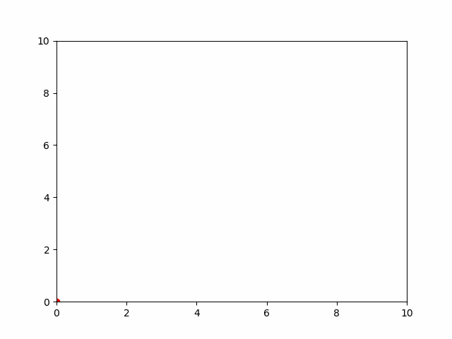

```py
import matplotlib.pyplot as plt
from matplotlib.animation import FuncAnimation

fig = plt.figure()
ax = fig.add_subplot(1, 1, 1)


def func(frame, x, y):
    ax.clear()
    plt.xlim(0, 10)
    plt.ylim(0, 10)
    ax.plot(x[frame % 10], y[frame % 10], 'ro')


x = [i for i in range(10)]
y = x

ani = FuncAnimation(fig, func, fargs=(x, y), frames=30, interval=200, repeat=True)
ani.save('animation.gif', dpi=80)
plt.show()
```

example: 匀速直线运动(Uniform Motion)
> $dx=v*dt$  
> 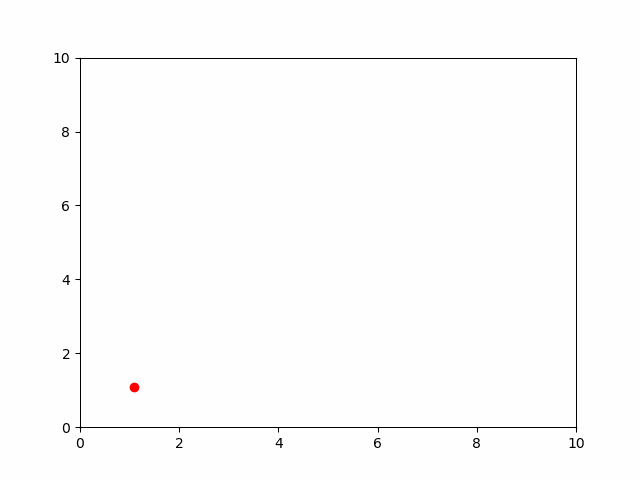

```py
import matplotlib.pyplot as plt
from matplotlib.animation import FuncAnimation

fig = plt.figure()
ax = fig.add_subplot(1, 1, 1)

coor = [1, 1]
velocity = [2, 2]
dt = 0.02


def func(frame):
    ax.clear()
    plt.xlim(0, 10)
    plt.ylim(0, 10)

    dx=velocity[0]*dt
    dy=velocity[1]*dt

    coor[0] += dx
    coor[1] += dy

    ax.plot(coor[0], coor[1], 'ro')


ani = FuncAnimation(fig, func, frames=30, interval=200, repeat=True)
ani.save('move01.gif', dpi=80)
plt.show()
```

example: 抛体运动
> $d\vec{v}=\vec{a}*dt, d\vec{x}=\vec{v}*dt$  
> 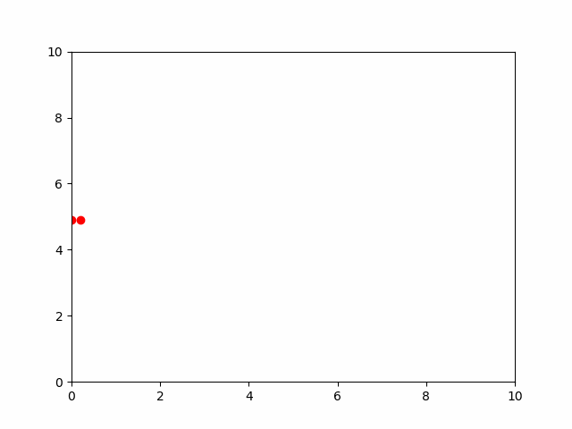

```py
import matplotlib.pyplot as plt
from matplotlib.animation import FuncAnimation

fig = plt.figure()
ax = fig.add_subplot(1, 1, 1)

coor = [0, 4.9]
velocity = [10, 0]
a=[0, -9.8]
dt = 0.02


def func(frame):
    # ax.clear()
    plt.xlim(0, 10)
    plt.ylim(0, 10)
    ax.plot(coor[0], coor[1], 'ro')

    coor[0] += velocity[0]*dt
    coor[1] += velocity[1]*dt
    
    velocity[0] += a[0]*dt
    velocity[1] += a[1]*dt
    
    # print(coor)

ani = FuncAnimation(fig, func, frames=50, interval=200, repeat=True)
ani.save('move02.gif', dpi=80)
plt.show()
```

example: 抛体到y=0反弹(projectile with bounce)
> 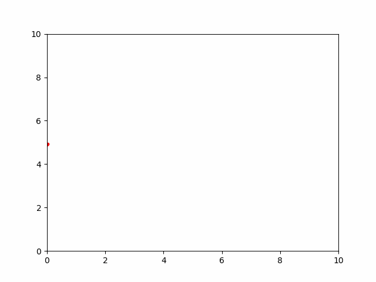

```py
import matplotlib.pyplot as plt
from matplotlib.animation import FuncAnimation

fig = plt.figure()
ax = fig.add_subplot(1, 1, 1)

coor = [0, 4.9]
velocity = [3, 3]
a=[0, -9.8]
dt = 0.01


def func(frame):
    # ax.clear()
    plt.xlim(0, 10)
    plt.ylim(0, 10)
    ax.plot(coor[0], coor[1], 'r.')

    coor[0] += velocity[0]*dt
    coor[1] += velocity[1]*dt
    
    velocity[0] += a[0]*dt
    velocity[1] += a[1]*dt
    
    # print(coor)
    if coor[1]<=0:
        velocity[1]=0.8*abs(velocity[1])

ani = FuncAnimation(fig, func, frames=100, interval=100, repeat=True)
ani.save('move02.gif', dpi=80)
plt.show()
```

example: 带有空气阻力的运动
> $\vec{a}=\vec{g}-kv^2\hat{v}=\vec{g}-k|v|\vec{v}, d\vec{v}=\vec{a}*dt, d\vec{x}=\vec{v}dt$  
> 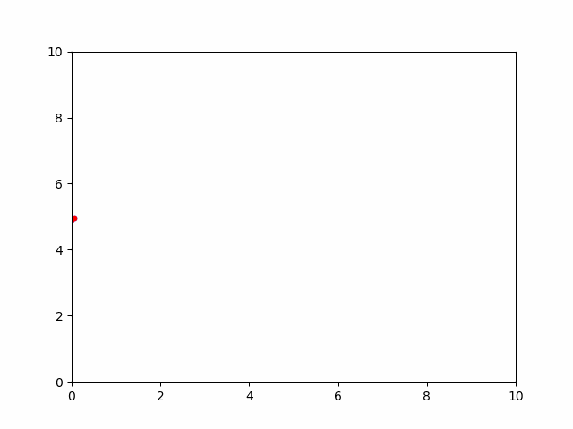

```py
import numpy as np
import matplotlib.pyplot as plt
from matplotlib.animation import FuncAnimation

fig = plt.figure()
ax = fig.add_subplot(1, 1, 1)

dt = 0.02

# without air drag
coor = np.array([0, 4.9])
v = np.array([3, 3])
g = np.array([0, -9.8])

# with air drag
coor_air = coor.copy()
v_air = v.copy()
a_air = g.copy()

# 空气阻力造成的加速度(带方向): -kv^2
k = 0.1


def func(frame):
    global coor, v, g, coor_air, v_air, a_air

    # ax.clear()
    plt.xlim(0, 10)
    plt.ylim(0, 10)
    ax.plot(coor[0], coor[1], 'b.')
    ax.plot(coor_air[0], coor_air[1], 'r.')

    coor = coor+v*dt
    coor_air = coor_air+v_air*dt

    v = v+g*dt
    v_air = v_air+a_air*dt

    # 模 x 矢量 得到 v^2
    a_air = g-k*np.linalg.norm(v_air)*v_air

    if coor[1] <= 0:
        v[1] = abs(v[1])

    if coor_air[1] <= 0:
        v_air[1] = abs(v_air[1])


ani = FuncAnimation(fig, func, frames=300, interval=100, repeat=True)
ani.save('move04.gif', dpi=80)
# plt.show()
```

example: simple harmonic motion
> $m\frac{d^2x}{dt^2}+kx=0$  
> $a=\frac{F}{m}=\frac{-k}{m}x$  
> $v=a*dt$  
> $x=v*dt$

```py
import numpy as np
import matplotlib.pyplot as plt

fig = plt.figure()

dt = 0.02
k = 4
m = 1
N = 300


def osc_pos():
    t = 0
    x = 3
    v = 0

    t_list = [t]
    x_list = [x]
    for _ in range(N-1):
        a = -k*x/m
        v += a*dt
        x += v*dt
        t += dt
        x_list.append(x)
        t_list.append(t)
    return t_list, x_list


# analytical result
t = np.arange(N)*dt
Omega = np.sqrt(k/m)
y_analytical = 3*np.cos(Omega*t)

# simulation result
t_list, x_list = osc_pos()

plt.plot(t, y_analytical, 'b.', t_list, x_list, 'r.')
plt.show()
```

example: simple harmonic motion with oscillation driven force
> $m\frac{d^2x}{dt^2}+kx=F_0\cos(\omega t)$, 通解+特解  
> $\omega_0=\sqrt{\frac{k}{m}}$  
> if $\omega\ne\omega_0$, $x=A\cos(\omega_0t)+B\sin(\omega_0t)+\frac{F_0/m}{\omega_0^2-\omega^2}\cos(\omega t)$;  
> if $\omega=\omega_0$,guess $x_{ih}=C\cos(\omega t)+D\sin(\omega t) \rightarrow x=tD\sin(\omega t), D=\frac{F_0}{2m\omega}$

```py
import numpy as np
import matplotlib.pyplot as plt

fig = plt.figure()

dt = 0.02
k = 4
m = 1
F0=10
Omega=3
N = 500


def osc_pos():
    t = 0
    x = 3
    v = 0

    t_list = [t]
    x_list = [x]
    for _ in range(N-1):
        a = -k*x/m+F0*np.cos(Omega*t)/m
        v += a*dt
        x += v*dt
        t += dt
        x_list.append(x)
        t_list.append(t)
    return t_list, x_list


# analytical result
t = np.arange(N)*dt
Omega0 = np.sqrt(k/m)
y_analytical = 5*np.cos(Omega0*t)+10/(Omega0**2-Omega**2)*np.cos(Omega*t)

# simulation result
t_list, x_list = osc_pos()

plt.plot(t, y_analytical, 'b.', t_list, x_list, 'r.')
plt.show()
```

example: 演示接近共振的情况
> 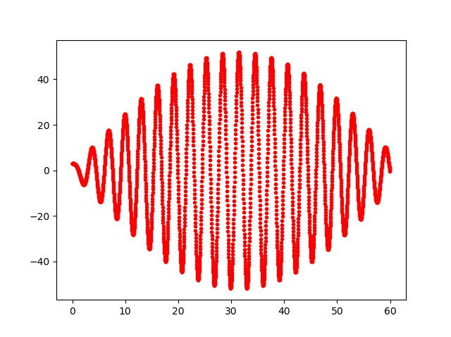  
> 该图是两个三角函数相乘，来自解析解中两个cos和差化积  

```py
import numpy as np
import matplotlib.pyplot as plt

fig = plt.figure()

dt = 0.02
k = 4
m = 1
F0=10
Omega=2.1
N = 3000


def osc_pos():
    t = 0
    x = 3
    v = 0

    t_list = [t]
    x_list = [x]
    for _ in range(N-1):
        a = -k*x/m+F0*np.cos(Omega*t)/m
        v += a*dt
        x += v*dt
        t += dt
        x_list.append(x)
        t_list.append(t)
    return t_list, x_list


# simulation result
t_list, x_list = osc_pos()

plt.plot(t_list, x_list, 'r.')
plt.show()
```

example: 共振
> let $\omega=\omega_0$
> 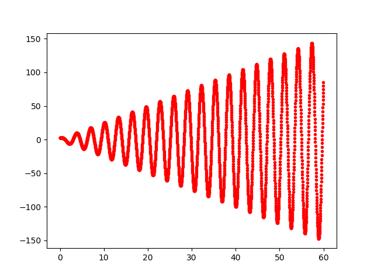

example: simple harmonic motion with friction
> $F=-kx-cv$  
> $m\frac{d^2x}{dt^2}+c\frac{dx}{dt}+kx=0$  
> if $c^2\ge 4km$, $x=Ae^\frac{-c+\sqrt{c^2-4km}}{2m}+Be^\frac{-c-\sqrt{c^2-4km}}{2m}$; c is large, decay  
> if $c^2\lt 4km$, $x=e^\frac{-c}{2m}*[A\cos(\frac{\sqrt{c^2-4km}}{2m}x)+B\sin(\frac{\sqrt{c^2-4km}}{2m}x)]$; c is small, decay+oscillation  

example: SHM with friction and driven force
> $F=-kx-cv+F_0\cos(\omega t)$  
> $m\frac{d^2x}{dt^2}+c\frac{dx}{dt}+kx=F_0\cos(\omega t)$  
> 特解guess: $x_{ih}=C\cos(\omega t)+D\sin(\omega t)\rightarrow\begin{cases}-Cm\omega^2+cD\omega+Ck=F_0\\-Dm\omega^2-cC\omega+kD=0\end{cases}$  

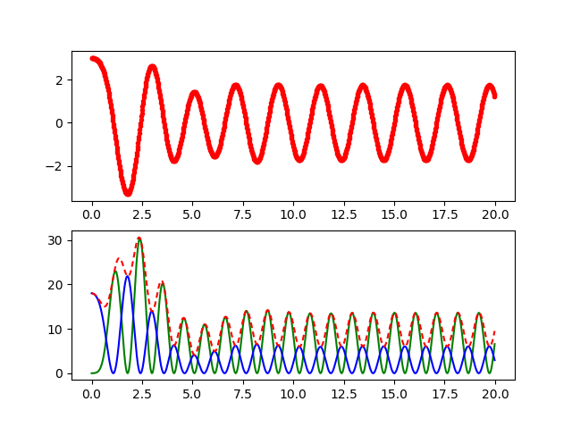

```py
import numpy as np
import matplotlib.pyplot as plt

fig = plt.figure()

dt = 0.02
k = 4
m = 1
c = 1
F0 = 10
Omega = 3
N = 1000


def osc_pos():
    t = 0
    x = 3
    v = 0

    t_list = [t]
    x_list = [x]
    KE_list = [0]  # kinetic energy
    PE_list = [0.5*k*x**2]  # potential energy
    for _ in range(N-1):
        a = -k*x/m+F0*np.cos(Omega*t)/m-c*v
        v += a*dt
        x += v*dt
        t += dt
        x_list.append(x)
        t_list.append(t)
        KE_list.append(0.5*m*v**2)
        PE_list.append(0.5*k*x**2)
    return t_list, x_list, KE_list, PE_list


# simulation result
t_list, x_list, ke_list, pe_list = osc_pos()
plt.subplot(2, 1, 1)
plt.plot(t_list, x_list, 'r.')

plt.subplot(2, 1, 2)
plt.plot(t_list, ke_list, 'g', t_list, pe_list, 'b')

ke_array = np.array(ke_list)
pe_array = np.array(pe_list)
plt.plot(t_list, ke_array+pe_array, 'r', dashes=[3, 2])
plt.show()
```

example: 2d string without friction and driven force
> if $m\frac{v^2}{r}=kr\rightarrow r=v\sqrt{\frac{m}{k}}$, 弹力提供向心力是圆周运动  
> 通过调节F0, c可以得到各种模拟结果

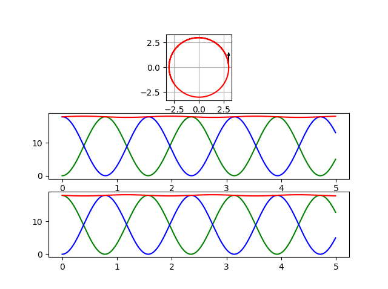

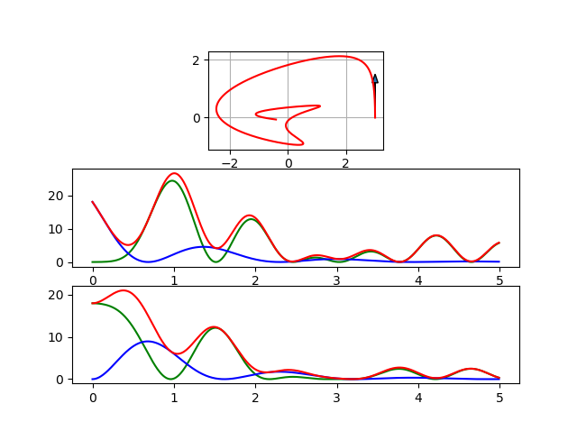

```py
import numpy as np
import matplotlib.pyplot as plt

fig = plt.figure()

dt = 0.01
k = 4
m = 1
c = 0
F0 = 0
Omega = 4
N = 500

start_pos = np.array([3.0, 0.0])
start_v = np.array([0.0, 3.0*np.sqrt(k/m)])


def osc_pos():
    t = 0
    pos = start_pos.copy()
    v = start_v.copy()

    t_list = []
    pos_list = []
    KE_list = []  # kinetic energy
    PE_list = []  # potential energy
    for _ in range(N):
        t_list.append(t)
        pos_list.append(pos.copy())
        KE_list.append(0.5*m*v**2)
        PE_list.append(0.5*k*pos**2)

        a = -k*pos/m+np.array([F0*np.cos(Omega*t)/m, 0])-c*v
        v += a*dt
        pos += v*dt
        t += dt

    pos_array = np.stack(pos_list, axis=0)
    ke_array = np.stack(KE_list, axis=0)
    pe_array = np.stack(PE_list, axis=0)
    return t_list, pos_array, ke_array, pe_array


# simulation result
t_list, pos_array, ke_array, pe_array = osc_pos()

ax1 = plt.subplot(3, 1, 1)
ax1.set_aspect('equal')
# x, y
plt.plot(pos_array[:, 0], pos_array[:, 1], 'r')
plt.arrow(start_pos[0], start_pos[1], start_v[0]*0.2, start_v[1]*0.2,head_width=0.2)
plt.grid()

plt.subplot(3, 1, 2)
plt.plot(t_list, ke_array[:,0], 'g', t_list, ke_array[:,1], 'b', t_list, ke_array[:,0]+ke_array[:,1], 'r')
plt.subplot(3, 1, 3)
plt.plot(t_list, pe_array[:,0], 'g', t_list, pe_array[:,1], 'b', t_list, pe_array[:,0]+pe_array[:,1], 'r')

plt.show()
```

example: two free ball connected by string with and without friction
> $\vec{F}=-k(|\vec{x_1}-\vec{x_2}|-l_0)\frac{\vec{x_1}-\vec{x_2}}{|\vec{x_1}-\vec{x_2}|}$  
> $\vec{a_1}=\vec{F}/m_1; \vec{v_1}+=\vec{a_1}*dt; \vec{x_1}+=\vec{v_1}*dt;$  
> $\vec{a_2}=-\vec{F}/m_2; \vec{v_2}+=\vec{a_2}*dt; \vec{x_2}+=\vec{v_2}*dt;$  

- without friction:
  > 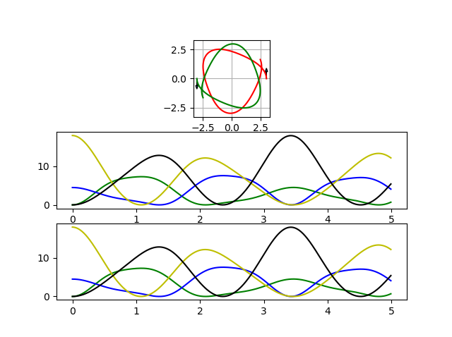
- with friction:
  > 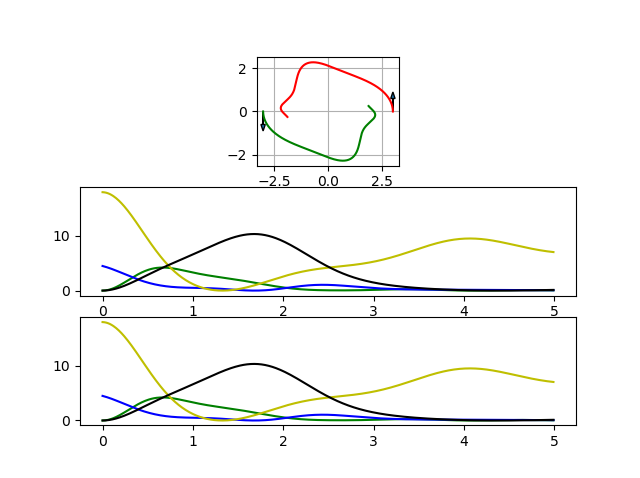
- show momentum:
  > 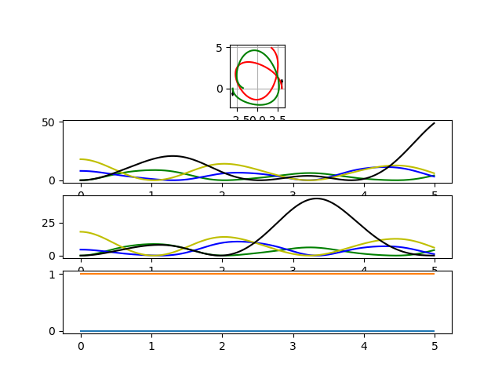

```py
import numpy as np
import matplotlib.pyplot as plt

fig = plt.figure()

dt = 0.01
k = 4
m1 = 1
m2 = 1
L0 = 4
c = 0
F0 = 10
Omega = 4
N = 500

x10 = np.array([3.0, 0.0])
x20 = np.array([-3.0, 0.0])
v10 = np.array([0.0, 4.0])
v20 = np.array([0.0, -3.0])


def osc_pos():
    t = 0
    x1 = x10.copy()
    x2 = x20.copy()
    v1 = v10.copy()
    v2 = v20.copy()

    t_list = []
    pos_list1 = []
    KE_list1 = []  # kinetic energy
    PE_list1 = []  # potential energy
    pos_list2 = []
    KE_list2 = []  # kinetic energy
    PE_list2 = []  # potential energy

    momentum_list1 = []  # momentum
    momentum_list2 = []
    for _ in range(N):
        t_list.append(t)
        pos_list1.append(x1.copy())
        KE_list1.append(0.5*m1*v1**2)
        PE_list1.append(0.5*k*x1**2)
        momentum_list1.append(m1*v1)

        pos_list2.append(x2.copy())
        KE_list2.append(0.5*m2*v2**2)
        PE_list2.append(0.5*k*x2**2)
        momentum_list2.append(m2*v2)

        F = -k*(np.linalg.norm(x1-x2)-L0)*(x1-x2)/np.linalg.norm(x1-x2)
        a1 = (F-c*v1)/m1
        a2 = (-F-c*v2)/m2

        v1 += a1*dt
        x1 += v1*dt
        v2 += a2*dt
        x2 += v2*dt
        t += dt

    pos_array1 = np.stack(pos_list1, axis=0)
    ke_array1 = np.stack(KE_list1, axis=0)
    pe_array1 = np.stack(PE_list1, axis=0)
    mom_array1 = np.stack(momentum_list1, axis=0)
    pos_array2 = np.stack(pos_list2, axis=0)
    ke_array2 = np.stack(KE_list2, axis=0)
    pe_array2 = np.stack(PE_list2, axis=0)
    mom_array2 = np.stack(momentum_list2, axis=0)
    return t_list, pos_array1, ke_array1, pe_array1, mom_array1, pos_array2, ke_array2, pe_array2, mom_array2


# simulation result
t_list, pos_array1, ke_array1, pe_array1, mom_array1, pos_array2, ke_array2, pe_array2, mom_array2 = osc_pos()

ax1 = plt.subplot(4, 1, 1)
ax1.set_aspect('equal')
# x, y
plt.plot(pos_array1[:, 0], pos_array1[:, 1], 'r')
plt.plot(pos_array2[:, 0], pos_array2[:, 1], 'g')
plt.arrow(x10[0], x10[1], v10[0] * 0.2, v10[1]*0.2, head_width=0.2)
plt.arrow(x20[0], x20[1], v20[0] * 0.2, v20[1]*0.2, head_width=0.2)
plt.grid()

plt.subplot(4, 1, 2)
plt.plot(t_list, ke_array1[:, 0], 'g', t_list, ke_array1[:, 1], 'b')
plt.plot(t_list, pe_array1[:, 0], 'y', t_list, pe_array1[:, 1], 'k')
plt.subplot(4, 1, 3)
plt.plot(t_list, ke_array2[:, 0], 'g', t_list, ke_array2[:, 1], 'b')
plt.plot(t_list, pe_array2[:, 0], 'y', t_list, pe_array2[:, 1], 'k')

plt.subplot(4, 1, 4)
plt.plot(t_list, mom_array1+mom_array2)

plt.show()
```

example: two body gravity(sun with earth)
> $\vec{F}=\frac{Gm_1m_2}{|\vec{x_1}-\vec{x_2}|^3}(\vec{x_1}-\vec{x_2})$  
> $\vec{a_1}=\vec{F}/m_1; \vec{v_1}+=\vec{a_1}*dt; \vec{x_1}+=\vec{v_1}*dt$  
> $\vec{a_2}=-\vec{F}/m_2; \vec{v_2}+=\vec{a_2}*dt; \vec{x_2}+=\vec{v_2}*dt$

```py
import numpy as np
import matplotlib.pyplot as plt


def Gravity(x1, x2, m1, m2):
    G = 6.673E-11
    r = np.linalg.norm(x1-x2)
    return G*m1*m2*(x2-x1)/r**3


m1 = 1.989E30  # sun
x10 = np.zeros(2)
v10 = np.zeros(2)
m2 = 5.972E24  # earth
x20 = np.array([1.496E11, 0.0])
v20 = np.array([0.0, 2.978E4])
dt = 24*3600  # 1d


def oribit():
    x1 = x10.copy()
    v1 = v10.copy()
    x2 = x20.copy()
    v2 = v20.copy()
    t = 0

    pos_list1 = []
    pos_list2 = []
    for _ in range(365):
        pos_list1.append(x1.copy())
        pos_list2.append(x2.copy())

        F = Gravity(x1, x2, m1, m2)
        a1 = F/m1
        a2 = -F/m2

        v1 += a1*dt
        v2 += a2*dt

        x1 += v1*dt
        x2 += v2*dt
        t = t+dt

    pos_array1 = np.stack(pos_list1, axis=0)
    pos_array2 = np.stack(pos_list2, axis=0)
    return pos_array1, pos_array2


pos_array1, pos_array2 = oribit()
ax = plt.subplot(1, 1, 1)
ax.set_aspect('equal')
plt.plot(pos_array1[:, 0], pos_array1[:, 1], 'ro',
         pos_array2[:, 0], pos_array2[:, 1], 'b')
plt.show()
```

example: 3 body gravity
> 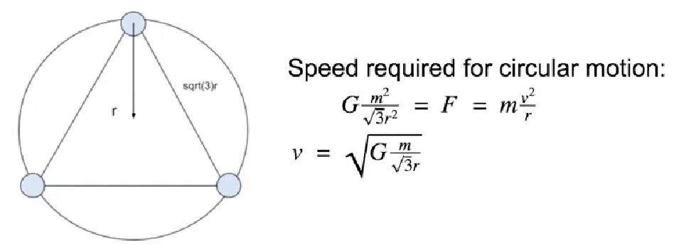  
> 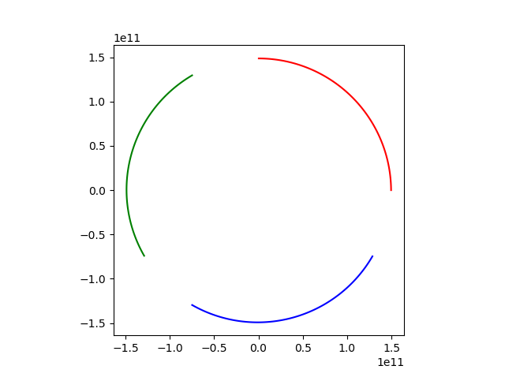


```py
import numpy as np
import matplotlib.pyplot as plt

G = 6.673E-11


def Gravity(x1, x2, m1, m2):
    r = np.linalg.norm(x1-x2)
    return G*m1*m2*(x2-x1)/r**3


m1 = 1.989E30  # sun
r0 = 1.496E11
v0 = np.sqrt(G*m1/np.sqrt(3)/r0)

x10 = np.array([r0, 0])
v10 = np.array([0, v0])
m2 = m1
x20 = np.array([r0*np.cos(np.pi*2/3), r0*np.sin(np.pi*2/3)])
v20 = np.array([v0*np.cos(np.pi*2/3+np.pi*0.5),
                v0*np.sin(np.pi*2/3+np.pi*0.5)])
m3 = m1
x30 = np.array([r0*np.cos(np.pi*4/3), r0*np.sin(np.pi*4/3)])
v30 = np.array([v0*np.cos(np.pi*4/3+np.pi*0.5),
                v0*np.sin(np.pi*4/3+np.pi*0.5)])
dt = 24*3600  # 1d


def oribit():
    x1 = x10.copy()
    v1 = v10.copy()
    x2 = x20.copy()
    v2 = v20.copy()
    x3 = x30.copy()
    v3 = v30.copy()
    t = 0

    pos_list1 = []
    pos_list2 = []
    pos_list3 = []
    for _ in range(120):
        pos_list1.append(x1.copy())
        pos_list2.append(x2.copy())
        pos_list3.append(x3.copy())

        F21 = Gravity(x1, x2, m1, m2)
        F23 = Gravity(x3, x2, m3, m2)
        F31 = Gravity(x1, x3, m1, m3)
        a1 = (F21+F31)/m1
        a2 = (-F21-F23)/m2
        a3 = (F23-F31)/m3

        v1 += a1*dt
        v2 += a2*dt
        v3 += a3*dt

        x1 += v1*dt
        x2 += v2*dt
        x3 += v3*dt

        t += dt

    pos_array1 = np.stack(pos_list1, axis=0)
    pos_array2 = np.stack(pos_list2, axis=0)
    pos_array3 = np.stack(pos_list3, axis=0)
    return pos_array1, pos_array2, pos_array3


pos_array1, pos_array2, pos_array3 = oribit()
ax = plt.subplot(1, 1, 1)
ax.set_aspect('equal')
plt.plot(pos_array1[:, 0], pos_array1[:, 1], 'r',
         pos_array2[:, 0], pos_array2[:, 1], 'g',
         pos_array3[:, 0], pos_array3[:, 1], 'b')
plt.show()
```