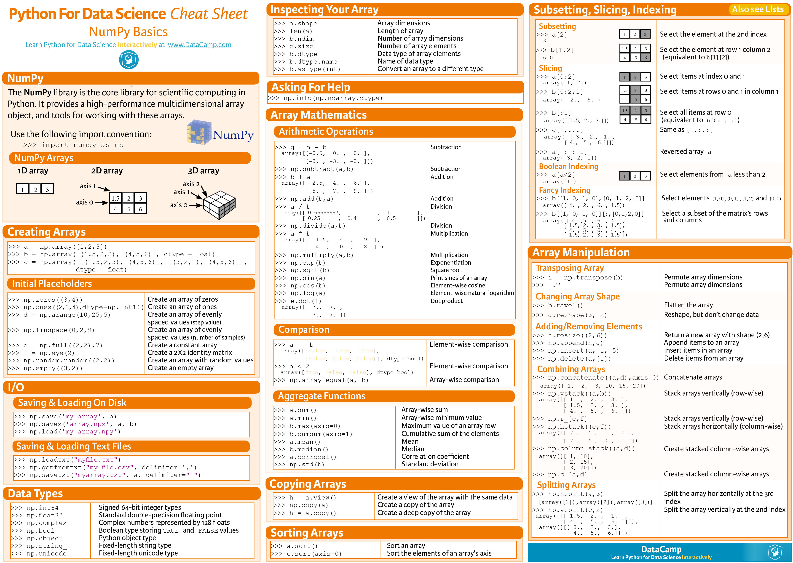
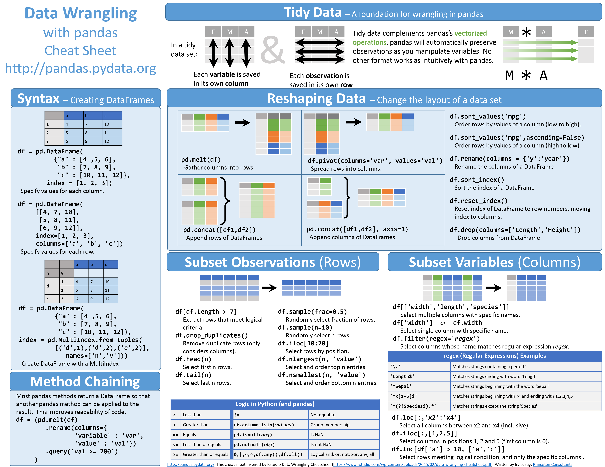
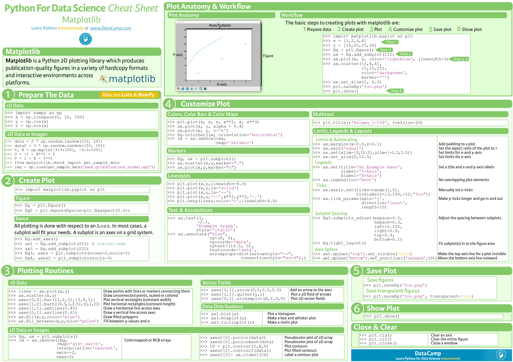
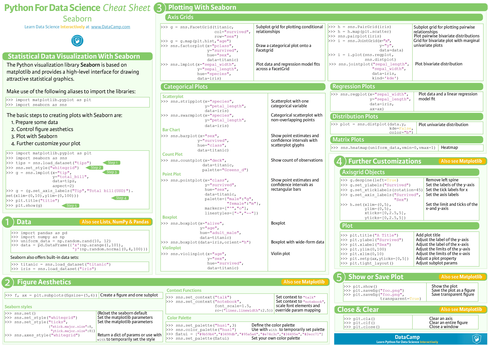

# DataScience

DataScience Procedure: IOSEMN
- Inquire: define your problems
- Obtain data: web scraper
- Scrub: pandas, numpy
- Explore: matplotlib, seaborn
- Model: scikit-learn, scipy, tensorflow2
- iNterpret: boken, D3.js

> - pandas, scipy 建立在numpy基础上
> - scikit-learn建立在scipy基础上, 提供常用的机器学习算法: 聚类(cluster analysis)、regression

数据获取:
- 主动爬虫
- 被动爬虫: 网站提供api, 比如weibo, twitter, [kaggle](https://www.kaggle.com), [google public data](https://www.google.com/publicdata/directory), [AWS public datasets](https://aws.amazon.com/opendata/public-datasets/)

[Tutorial](https://www.kaggle.com/kernels)

DataScience CheatSheet
>   
>   
>   
> 

## pandas-datareader

> `conda install pandas-datareader`

```py
import pandas_datareader as pdr

# get data from yahoo
alibaba=pdr.get_data_yahoo('BABA')
alibaba.tail()
alibaba.describe()
alibaba.info()
```

example: simple plot

```py
import numpy as np
import pandas as pd
import matplotlib.pyplot as plt
import pandas_datareader as pdr

start_date='20180920'
alibaba=pdr.get_data_yahoo('BABA', start=start_date)
amazon=pdr.get_data_yahoo('AMZN', start=start_date)

alibaba['dailyReturn']=alibaba.Close.pct_change()
alibaba['dailyReturn'].plot(figsize=(10, 4), marker='o')
alibaba['dailyReturn'].plot(kind='hist')
```

