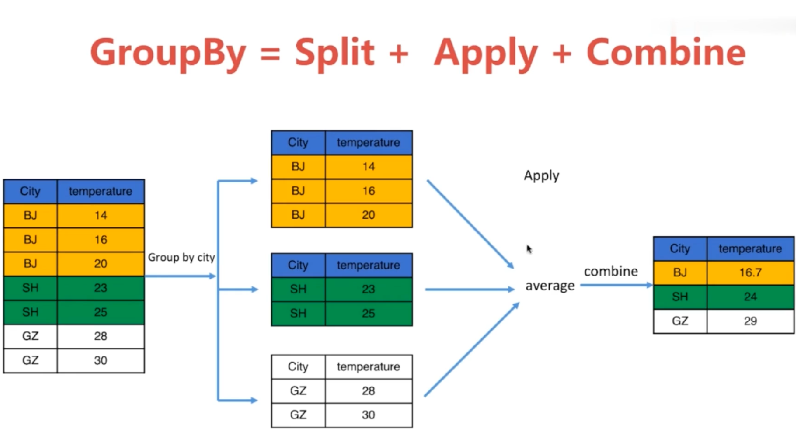

# Pandas

- [Pandas](#pandas)
  - [Series](#series)
  - [DataFrame](#dataframe)
  - [simple operation](#simple-operation)
  - [index and columns rename](#index-and-columns-rename)
  - [merge & concatenate & combine](#merge--concatenate--combine)
  - [apply](#apply)
  - [drop duplicate](#drop-duplicate)
  - [datetime & resample](#datetime--resample)
  - [pivot](#pivot)
  - [reindex](#reindex)
  - [NAN](#nan)
  - [multiindex](#multiindex)
  - [map](#map)
  - [replace](#replace)
  - [bins & groupby & aggregate](#bins--groupby--aggregate)


## Series

```py
import numpy as np
import pandas as pd

s1=pd.Series([10, 20, 3., 40])
# 0    10.0
# 1    20.0
# 2     3.0
# 3    40.0
# dtype: float64

s1.values
# array([10., 20.,  3., 40.])
s2.index
# RangeIndex(start=0, stop=4, step=1)

s2=pd.Series(np.arange(10))
s2[s2>5]
# 6    6
# 7    7
# 8    8
# 9    9
# dtype: int64

s3=pd.Series({'1':10, '2':20, '3':30})
# 1    10
# 2    20
# 3    30
# dtype: int64
s3.values
# array([10, 20, 30])
s3.index
# Index(['1', '2', '3'], dtype='object')

s4=pd.Series([11, 22, 33, 44], index=['A', 'B', 'C', 'D'])
# A    11
# B    22
# C    33
# D    44
# dtype: int64
s4['B']
# 22
s4.to_dict()
# {'A': 11, 'B': 22, 'C': 33, 'D': 44}

s5=pd.Series(s4, index=['A', 'B', 'C', 'D', 'E'])
# A    11.0
# B    22.0
# C    33.0
# D    44.0
# E     NaN
# dtype: float64
pd.isnull(s5)
# A    False
# B    False
# C    False
# D    False
# E     True
# dtype: bool
pd.notnull(s5)
# A     True
# B     True
# C     True
# D     True
# E    False
# dtype: bool
s5.name='demo'
# A    11.0
# B    22.0
# C    33.0
# D    44.0
# E     NaN
# Name: demo, dtype: float64
s5.index.name='grey'
# grey
# A    11.0
# B    22.0
# C    33.0
# D    44.0
# E     NaN
# Name: demo, dtype: float64
```

## DataFrame

DataFrame本质由一列列的Series组成

[dataframe io](https://pandas.pydata.org/pandas-docs/stable/user_guide/io.html)

| Format Type | Data Description     | Reader         | Writer       |
|-------------|----------------------|----------------|--------------|
| text        | CSV                  | read_csv       | to_csv       |
| text        | JSON                 | read_json      | to_json      |
| text        | HTML                 | read_html      | to_html      |
| text        | Local clipboard      | read_clipboard | to_clipboard |
| binary      | MS Excel             | read_excel     | to_excel     |
| binary      | OpenDocument         | read_excel     |              |
| binary      | HDF5 Format          | read_hdf       | to_hdf       |
| binary      | Feather Format       | read_feather   | to_feather   |
| binary      | Parquet Format       | read_parquet   | to_parquet   |
| binary      | Msgpack              | read_msgpack   | to_msgpack   |
| binary      | Stata                | read_stata     | to_stata     |
| binary      | SAS                  | read_sas       |              |
| binary      | Python Pickle Format | read_pickle    | to_pickle    |
| SQL         | SQL                  | read_sql       | to_sql       |
| SQL         | Google Big Query     | read_gbq       | to_gbq       |

```py
import numpy as np
import pandas as pd

s0=pd.Series([1, 2, 3], index=['a', 'b', 'c'])
s1=pd.Series([4, 5, 6], index=['b', 'c', 'd'])

df1=pd.DataFrame()
df1['BJ']=s0
df1['SH']=s1
# 	BJ 	SH
# a 	1 	NaN
# b 	2 	4.0
# c 	3 	5.0

for row in df1.iterrows():
    print(type(row)) # tuple
    # index, values
    print(type(row[0]), type(row[1])) # <class 'str'> <class 'pandas.core.series.Series'>
    print(row[1].index) # Index(['BJ', 'SH'], dtype='object')

type(df1['BJ']) # pandas.core.series.Series
df1['BJ'].index # Index(['a', 'b', 'c'], dtype='object')

df2=pd.DataFrame([s0, s1])
#  	a 	b 	c 	d
# 0 	1.0 	2.0 	3.0 	NaN
# 1 	NaN 	4.0 	5.0 	6.0
```

```py
import numpy as np
import pandas as pd

# read all table form TOIBE
df0=pd.read_html('https://www.tiobe.com/tiobe-index/')[0]

type(df0)
# pandas.core.frame.DataFrame
df0
# ...

df0.columns
# Index(['Nov 2019', 'Nov 2018', 'Change', 'Programming Language', 'Ratings', 'Change.1'],dtype='object')

# 如果column name无空格
df0.Ratings.values
# array([...])
# 如果column name有空格
df0['Nov 2019'].values1
# array([...])

type(df0['Nov 2019'])
# pandas.core.series.Series
df_new=pd.DataFrame(df0, columns=['Programming Language', 'Ratings','Change.1'])
# ...

# add new column "Share"
df_new2=pd.DataFrame(df0, columns=['Programming Language', 'Ratings','Change.1', 'Share'])
# 3 methods to set column
df_new2['Share']=range(20)
# df_new2['Share']=np.arange(20)
# df_new2['Share']=pd.Series(np.arange(20))

# modify column(not recommended)
df_new2['Share'][3:5]=[33, 44]
# modify column(recommended)
df_new2['Share'].values[3:5]=[33,44]

# replace whole column
df_new2['Share']=pd.Series([55, 66], index=[5, 6])
```


pandas indexing

```py
# some function
df0.shape
df0.head() # first 5 records
df0.head(10) # first 10 records
df0.tail() # last 5 records
df0.to_records(index=False) # to list of tuples

# indexing dataframe
df0['Ratings']
df0[['Ratings', 'Nov 2019']]
df0[['Ratings', 'Nov 2019']][10:15]
df0.iloc[10:15,4:6]
df0.loc[10:15, ['Ratings', 'Nov 2019']] 
df0.loc[10:15, :"Ratings"] 
```

example: iloc vs loc

```py
df1=df0[10:20]
# Nov 2019 	Nov 2018 	Change 	Programming Language 	Ratings 	Change.1
# 10 	11 	16 	NaN 	Ruby 	1.261% 	+0.17%
# 11 	12 	11 	NaN 	Objective-C 	1.195% 	-0.28%
# 12 	13 	13 	NaN 	Delphi/Object Pascal 	1.142% 	-0.28%
# 13 	14 	25 	NaN 	Groovy 	1.099% 	+0.50%
# 14 	15 	15 	NaN 	Assembly language 	1.022% 	-0.09%
# 15 	16 	14 	NaN 	R 	0.980% 	-0.43%
# 16 	17 	20 	NaN 	Visual Basic 	0.957% 	+0.10%
# 17 	18 	23 	NaN 	D 	0.927% 	+0.25%
# 18 	19 	17 	NaN 	MATLAB 	0.890% 	-0.14%
# 19 	20 	10 	NaN 	Go 	0.853% 	-0.64%

# 严格根据index索引
df1.iloc[5:8] 
#  	Nov 2019 	Nov 2018 	Change 	Programming Language 	Ratings 	Change.1
# 15 	16 	14 	NaN 	R 	0.980% 	-0.43%
# 16 	17 	20 	NaN 	Visual Basic 	0.957% 	+0.10%
# 17 	18 	23 	NaN 	D 	0.927% 	+0.25%

# 根据label索引
df1.loc[15:17]
#  	Nov 2019 	Nov 2018 	Change 	Programming Language 	Ratings 	Change.1
# 15 	16 	14 	NaN 	R 	0.980% 	-0.43%
# 16 	17 	20 	NaN 	Visual Basic 	0.957% 	+0.10%
# 17 	18 	23 	NaN 	D 	0.927% 	+0.25%
```

## simple operation

```py
import numpy as np
import pandas as pd

s1=pd.Series([1, 2, 3], index=['a', 'b', 'c'])
s2=pd.Series([4, 5, 6], index=['b', 'c', 'd'])
s1+s2 # 对应index相加
# a    NaN
# b    6.0
# c    8.0
# d    NaN
# dtype: float64

# Series sort
s1.sort_values(ascending=False)
s1.sort_index(ascending=False)

df1=pd.DataFrame(np.arange(4).reshape(2, 2), index=['a', 'b'], columns=['BJ', 'SH'])
df2=pd.DataFrame(np.arange(9).reshape(3, 3), index=['a', 'b', 'c'], columns=['BJ', 'SH', 'SZ'])
df1+df2

# DataFrame sort
df1.sort_values(by='BJ', ascending=False)
df1.sort_index(ascending=False)

df3=pd.DataFrame([[1, 2, 3], [4, 5, np.nan]], index=['a', 'b'], columns=['BJ', 'SH','SZ'])
df3.sum()
# df3.sum(axis=1)
df3.min()
# BJ    1.0
# SH    2.0
# SZ    3.0
# dtype: float64

df3.describe()
```

## index and columns rename

```py
import numpy as np
import pandas as pd

df1=pd.DataFrame(np.arange(9).reshape(3, 3))
#  	0 	1 	2
# 0 	0 	1 	2
# 1 	3 	4 	5
# 2 	6 	7 	8

# Index本质是Series的一种
df1.index=pd.Series(['bj', 'sh', 'sz'])
# 	0 	1 	2
# bj 	0 	1 	2
# sh 	3 	4 	5
# sz 	6 	7 	8
df1.index=df1.index.map(str.upper)
#  	0 	1 	2
# BJ 	0 	1 	2
# SH 	3 	4 	5
# SZ 	6 	7 	8

df2=df1.rename(index=str.lower, columns=lambda x:f'col-{x}')
# 	col-0 	col-1 	col-2
# bj 	0 	1 	2
# sh 	3 	4 	5
# sz 	6 	7 	8
df3=df2.rename(index={'bj':'BJ', 'sh':'SH'}, columns={'col-1':'col1'})
#  	col-0 	col1 	col-2
# BJ 	0 	1 	2
# SH 	3 	4 	5
# sz 	6 	7 	8
```

```py
# simple example for python
list1=[1, 2, 3, 4]
list2=[str(i) for i in list1]
list3=list(map(str, list1))
```

## merge & concatenate & combine

example: merge

```py
import numpy as np
import pandas as pd

df1=pd.DataFrame({'key':['a','b','c', 'a'], 'c1':[4, 5, 6, 7]})
df2=pd.DataFrame({'key':['a','B','c'], 'co1':[1, 2, 3]})

pd.merge(df1, df2)
pd.merge(df1, df2, on='key', how='left')
pd.merge(df1, df2, on='key', how='right')
pd.merge(df1, df2, on='key', how='outer')
```

example: concatenate

```py
import numpy as np
import pandas as pd

a1=np.eye(3)
a2=np.eye(3)
a3=np.concatenate([a1, a2])
a4=np.concatenate([a1, a2], axis=1)

s1=pd.Series([1, 2, 3], index=['x', 'y', 'z'])
s2=pd.Series([4, 5], index=['a', 'b'])
s3=pd.concat([s1, s2])
# x    1
# y    2
# z    3
# a    4
# b    5
# dtype: int64
s4=pd.concat([s1, s2], axis=1, sort=True)
#  	0 	1
# a 	NaN 	4.0
# b 	NaN 	5.0
# x 	1.0 	NaN
# y 	2.0 	NaN
# z 	3.0 	NaN

df1=pd.DataFrame(np.eye(3), columns=['x' ,'y', 'z'])
df2=pd.DataFrame(np.eye(3), columns=['a' ,'b', 'c'])
df3=pd.concat([df1, df2], sort=True)
# 	a 	b 	c 	x 	y 	z
# 0 	NaN 	NaN 	NaN 	1.0 	0.0 	0.0
# 1 	NaN 	NaN 	NaN 	0.0 	1.0 	0.0
# 2 	NaN 	NaN 	NaN 	0.0 	0.0 	1.0
# 0 	1.0 	0.0 	0.0 	NaN 	NaN 	NaN
# 1 	0.0 	1.0 	0.0 	NaN 	NaN 	NaN
# 2 	0.0 	0.0 	1.0 	NaN 	NaN 	NaN
df4=pd.concat([df1, df2], axis=1)
# 	x 	y 	z 	a 	b 	c
# 0 	1.0 	0.0 	0.0 	1.0 	0.0 	0.0
# 1 	0.0 	1.0 	0.0 	0.0 	1.0 	0.0
# 2 	0.0 	0.0 	1.0 	0.0 	0.0 	1.0
```

example: combine

```py
import numpy as np
import pandas as pd

s1=pd.Series([1, np.nan, 3], index=['x', 'y', 'z'])
s2=pd.Series([4, 5, 6], index=['x', 'y', 'z'])
s3=s1.combine_first(s2)
# x    1.0
# y    5.0
# z    3.0
# dtype: float64

df1=pd.DataFrame([[1, np.nan, 3],[4, np.nan, np.nan],[np.nan, 8, 9]], columns=['x' ,'y', 'z'])
df2=pd.DataFrame(np.ones((4, 3)), columns=['x' ,'y', 'z'])
df3=df1.combine_first(df2)
#  	x 	y 	z
# 0 	1.0 	1.0 	3.0
# 1 	4.0 	1.0 	1.0
# 2 	1.0 	8.0 	9.0
# 3 	1.0 	1.0 	1.0
```

## apply

```bash
# Book.csv
time,data
1473411962,id: 1 score: 10 age: 22
1473411962,id: 1 score: 13 age: 23
1473411962,id: 1 score: 10 age: 24
1473411962,id: 4 score: 10 age: 25
1473411963,id: 5 score: 10 age: 26
1473411964,id: 6 score: 89 age: 27
1473411965,id: 7 score: 10 age: 28
1473411966,id: 8 score: 56 age: 29
1473411967,id: 9 score: 10 age: 30
```

```py
import numpy as np
import pandas as pd

df1=pd.read_csv('Book1.csv')
df1.shape[0] # 9

df1['new_col']=pd.Series(['a']*9)
df1['new_col']=df1['new_col'].apply(str.upper)

def func(line):
    items=line.split(' ')
    return pd.Series([items[1], items[3], items[5]])

df2=df1['data'].apply(func)
df3=df2.rename(columns={0:'id', 1:'score', 2:'age'})
df_new=df1.combine_first(df3)
#  	age 	data 	id 	new_col 	score 	time
# 0 	22.0 	id: 1 score: 10 age: 22 	1.0 	A 	10.0 	1473411962
# 1 	23.0 	id: 1 score: 13 age: 23 	2.0 	A 	13.0 	1473411962
# 2 	24.0 	id: 1 score: 10 age: 24 	3.0 	A 	10.0 	1473411962
# 3 	25.0 	id: 4 score: 10 age: 25 	4.0 	A 	10.0 	1473411962
# 4 	26.0 	id: 5 score: 10 age: 26 	5.0 	A 	10.0 	1473411963
# 5 	27.0 	id: 6 score: 89 age: 27 	6.0 	A 	89.0 	1473411964
# 6 	28.0 	id: 7 score: 10 age: 28 	7.0 	A 	10.0 	1473411965
# 7 	29.0 	id: 8 score: 56 age: 29 	8.0 	A 	56.0 	1473411966
# 8 	30.0 	id: 9 score: 10 age: 30 	9.0 	A 	10.0 	1473411967

del df_new['data']
df_new.to_csv('Book2.csv', index=False)
```

## drop duplicate

```py
import numpy as np
import pandas as pd

df1=pd.read_csv('Book2.csv')
len(df1) # 9
len(df1['id'].unique()) # 7
df1['id'].duplicated()
# 0    False
# 1     True
# 2     True
# 3    False
# 4    False
# 5    False
# 6    False
# 7    False
# 8    False
# Name: id, dtype: bool

df1.drop_duplicates()
df1.drop_duplicates(['id'])
```

## datetime & resample

example: datetime

```py
import numpy as np
import pandas as pd
from datetime import datetime

datetime_list=[
    datetime(2017, 1, 1),
    datetime(2017, 10, 1),
    datetime(2017, 10, 11),
    datetime(2019, 1, 1),
    datetime(2020, 1, 1),
]
s1=pd.Series(range(5), index=datetime_list)
# following 4 is the same
s1[1]
s1[datetime(2017, 10, 1)]
s1['2017-10-1']
s1['20171001']

s1['2017']
# 2017-01-01    0
# 2017-10-01    1
# 2017-10-11    2
# dtype: int64

date_list2=pd.date_range(start='20191001', periods=10) # every day
date_list3=pd.date_range(start='20191001', periods=10, freq='W-MON') # every monday
date_list4=pd.date_range(start='20191001', periods=10, freq='5H') # every 5 hours
```

exmaple: resample

```py
import numpy as np
import pandas as pd

t_range=pd.date_range('20190101', '20191231')
s1=pd.Series(np.random.randn(len(t_range)), index=t_range)
# date shrink
s2=s1.resample('M').mean()
# data grow
s3=s1.resample('H').ffill() # forward fill, backword fill: bfill
```

example: stock plot

```py
import numpy as np
import pandas as pd
import matplotlib.pyplot as plt

t_range=pd.date_range('20190101', '20191231', freq='H')
stock_df=pd.DataFrame(index=t_range)
stock_df['BABA']=np.random.randint(10, 100, size=len(t_range))
stock_df['TECENT']=np.random.randint(10, 60, size=len(t_range))

weekly_df=pd.DataFrame()
weekly_df['BABA']=stock_df['BABA'].resample('W').mean()
weekly_df['TECENT']=stock_df['TECENT'].resample('W').mean()

weekly_df.plot()
```

## pivot

透视表可以简单统计分析数据，但是需要对表结构有一定了解

```bash
# sales-funnel.csv
Account;Name;Rep;Manager;Product;Quantity;Price;Status
714466;Trantow-Barrows;Craig Booker;Debra Henley;CPU;1;30000;presented
714466;Trantow-Barrows;Craig Booker;Debra Henley;Software;1;10000;presented
714466;Trantow-Barrows;Craig Booker;Debra Henley;Maintenance;2;5000;pending
737550;Fritsch, Russel and Anderson;Craig Booker;Debra Henley;CPU;1;35000;declined
146832;Kiehn-Spinka;Daniel Hilton;Debra Henley;CPU;2;65000;won
218895;Kulas Inc;Daniel Hilton;Debra Henley;CPU;2;40000;pending
218895;Kulas Inc;Daniel Hilton;Debra Henley;Software;1;10000;presented
412290;Jerde-Hilpert;John Smith;Debra Henley;Maintenance;2;5000;pending
740150;Barton LLC;John Smith;Debra Henley;CPU;1;35000;declined
141962;Herman LLC;Cedric Moss;Fred Anderson;CPU;2;65000;won
163416;Purdy-Kunde;Cedric Moss;Fred Anderson;CPU;1;30000;presented
239344;Stokes LLC;Cedric Moss;Fred Anderson;Maintenance;1;5000;pending
239344;Stokes LLC;Cedric Moss;Fred Anderson;Software;1;10000;presented
307599;Kassulke, Ondricka and Metz;Wendy Yule;Fred Anderson;Maintenance;3;7000;won
688981;Keeling LLC;Wendy Yule;Fred Anderson;CPU;5;100000;won
729833;Koepp Ltd;Wendy Yule;Fred Anderson;CPU;2;65000;declined
729833;Koepp Ltd;Wendy Yule;Fred Anderson;Monitor;2;5000;presented
```

```py
import numpy as np
import pandas as pd

df=pd.read_csv('sales-funnel.csv', sep=';')

pd.pivot_table(df, index=['Name'])
pd.pivot_table(df, index=['Name'], aggfunc='sum')

pd.pivot_table(df, index=['Manager', 'Rep'])
pd.pivot_table(df, index=['Manager', 'Rep', 'Name'])

pd.pivot_table(df, index=['Manager', 'Rep'], values=['Account', 'Price'], columns=['Product'], aggfunc='sum', fill_value=0)
```

> 

## reindex

Series reindex

```py
import numpy as np
import pandas as pd

s0=pd.Series([1, 2, 3, 4], index=['a', 'b', 'c', 'd'])
# a    1
# b    2
# c    3
# d    4
# dtype: int64
s1=s0.reindex(index=['a', 'b', 'C', 'D', 'E'], fill_value=10)
# a     1
# b     2
# C    10
# D    10
# E    10
# dtype: int64
s1.reindex(index=['a', 'b'])
# a     1
# b     2
# dtype: int64
s1.drop('a')
# b     2
# C    10
# D    10
# E    10
# dtype: int64

s2=pd.Series(['a', 'b', 'c'], index=[1, 5, 10])
# 1     a
# 5     b
# 10    c
# dtype: object

s3=s2.reindex(index=range(12), method='ffill')
# 0     NaN
# 1       a
# 2       a
# 3       a
# 4       a
# 5       b
# 6       b
# 7       b
# 8       b
# 9       b
# 10      c
# 11      c
# dtype: object
```

DataFrame reindex

```py
import numpy as np
import pandas as pd

df0=pd.DataFrame(np.random.rand(16).reshape(4, 4), index=['a', 'b', 'd', 'e'], columns=['c1', 'c2', 'c3', 'c4'])
#     c1 	c2 	c3 	c4
# a 	0.819308 	0.079193 	0.924312 	0.866187
# b 	0.148369 	0.459822 	0.059087 	0.812420
# d 	0.869805 	0.124662 	0.825912 	0.922507
# e 	0.679514 	0.325763 	0.709922 	0.144940
df1=df0.reindex(index=['a', 'b', 'c', 'd', 'e'])
df2=df0.reindex(columns=['c1', 'c2', 'c3', 'c4', 'c5'])
df3=df1=df0.reindex(index=['a', 'b', 'c', 'd', 'e'], columns=['c1', 'c2', 'c3', 'c4', 'c5'])

df3.reindex(index=['a', 'd', 'e'])
df3.reindex(columns=['c1', 'c2', 'c4'])
df3.drop(index=['a', 'b'], axis=0)
df3.drop(columns=['c1', 'c2'], axis=1)
```

## NAN

> tip: jupyter中`Shift+Tab`查看docstring

```py
import numpy as np
import pandas as pd

a=np.nan
type(a) # float
a+1 # nan

# Series with nan
s0=pd.Series([1, 2, np.nan, 4])
# 0    1.0
# 1    2.0
# 2    NaN
# 3    4.0
# dtype: float64
s0.isnull()
s0.notnull()
s0.dropna() # 不改变s0

# DataFrame with nan
df0=pd.DataFrame([[1, 2, 3], [5, np.nan,6], [7, np.nan, np.nan]])
# 	0 	1 	2
# 0 	1 	2.0 	3.0
# 1 	5 	NaN 	6.0
# 2 	7 	NaN 	NaN
df0.isnull()
df0.notnull()
df0.dropna()
df0.dropna(axis=0)
df0.dropna(axis=1)
df0.dropna(axis=0, how='all')

# nan数目>=2,会被删除
df0.dropna(thresh=2, axis=1)
df0.fillna(value=1)

# column 0 fill with 0, column 1 fill with 11, column 2 fill with 22
df0.fillna(value={0:0, 1:11, 2:22})
#  	0 	1 	2
# 0 	1 	2.0 	3.0
# 1 	5 	11.0 	6.0
# 2 	7 	11.0 	22.0
```

## multiindex

多级index让Series具有二维结构

```py
import numpy as np
import pandas as pd

s0=pd.Series(np.random.randn(6), index=[['1', '1', '1', '2', '2', '2'], ['a', 'b', 'c', 'a', 'b', 'c']])
# 1  a    2.003880
#    b    0.102215
#    c    0.587213
# 2  a   -1.305691
#    b   -0.205484
#    c    0.964941
# dtype: float64
s0['1']['c']
s0[:,'a']
df0=s0.unstack()
# 	a 	b 	c
# 1 	2.003880 	0.102215 	0.587213
# 2 	-1.305691 	-0.205484 	0.964941
# or
df1=pd.DataFrame([s0['1'], s0['2']])

s2=df1.unstack()
# a  0    2.003880
#    1   -1.305691
# b  0    0.102215
#    1   -0.205484
# c  0    0.587213
#    1    0.964941
# dtype: float64
s3=df1.T.unstack()
# 0  a    2.003880
#    b    0.102215
#    c    0.587213
# 1  a   -1.305691
#    b   -0.205484
#    c    0.964941
# dtype: float64

# 多级index的DataFrame
df2=pd.DataFrame(np.random.randn(16).reshape(4, 4), index=[['a', 'a', 'b', 'b'], [1, 2, 1, 2]], columns=[['BJ', 'BJ', 'SH', 'SZ'], [8, 9, 8, 8]])
#  		BJ 	SH 	SZ
# 		8 	9 	8 	8
# a 	1 	-1.303202 	-0.884724 	0.830207 	-0.274237
# 2 	0.772264 	-1.293091 	0.550154 	0.239424
# b 	1 	0.635577 	-0.184073 	1.162522 	-0.264281
# 2 	0.578760 	-0.111816 	-2.348368 	0.302795
df2['BJ']
```

## map

```py
import numpy as np
import pandas as pd

df0=pd.DataFrame({'city':['BJ', 'SH', 'SZ'], 'population':[1000, 2000, 1500]})
# 	city 	population
# 0 	BJ 	1000
# 1 	SH 	2000
# 2 	SZ 	1500

gdp_map={'BJ':2, 'SH': 10, 'SZ':8}
df0['GDP']=df0['city'].map(gdp_map)

# 仅仅适用于没有指定index的情形
df0['GDP']=pd.Series([20, 100, 80])

df1=pd.DataFrame({'city':['BJ', 'SH', 'SZ'], 'population':[1000, 2000, 1500]}, index=['a', 'b', 'c'])
# 必须指定index,否则全是NaN
df1['GDP']=pd.Series([20, 100, 80], index=['a', 'b', 'c'])
```

## replace

```py
import numpy as np
import pandas as pd

s0=pd.Series(range(10))
s0.replace(1, 11)
s0.replace({2:22, 3:33})
s0.replace([5, 6, 7], [55, 66, 77])
```

## bins & groupby & aggregate

> 

```py
import numpy as np
import pandas as pd

score_list=np.random.randint(100, size=50)
# (0, 59], (59, 70], (70, 80], (80, 100]
bins=[0, 59, 70, 80, 100]
score_cut=pd.cut(score_list, bins)
pd.value_counts(score_cut)


df=pd.DataFrame()
df['score']=score_list
df['student']=[pd.util.testing.rands(4) for _ in range(50)]
df['category']=pd.cut(df['score'], bins, labels=['low', 'ok', 'good', 'great'])

# groupby
# g1=df.groupby(df['category'])
g1=df.groupby('category')
g1.groups

df1=g1.get_group('good') # return is dataframe

# (70, 80] average score
df1.mean() # return is Series

# groupby=split+Apply mean()+combine
g1.mean() # return is DataFrame
# g1.max()
# g1.min()

# group to list or dictionary
for category, df in list(g1):
    print(category)
    print(df)

dict1=dict(list(g1))
dict1['great'] # return is DataFrame

# aggregate
g1.describe() # get many statistical info
g1.agg('min')
# 	score 	student
# category 		
# low 	2 	0ZpN
# ok 	61 	BBV8
# good 	71 	FLuE
# great 	82 	0KC3
def custom_agg(category):
    return category.max()-category.min()

g1.agg(custom_agg)
# 	score
# category 	
# low 	56
# ok 	8
# good 	6
# great 	14
```

example: multi group
> 一般multi group之后通过`unstack`来得到dataframe

```py
g2=df.groupby(['weather', 'wind'])
g2.groups
g2.get_group(('BJ', 3))

for (name1, name2), group in g2:
    pass
```